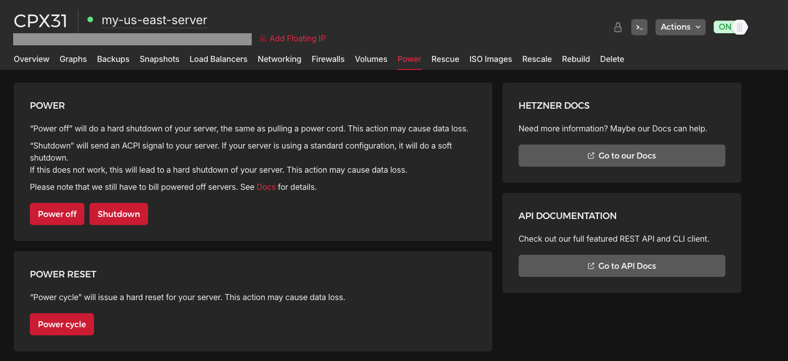
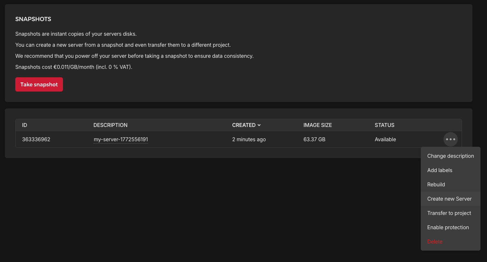
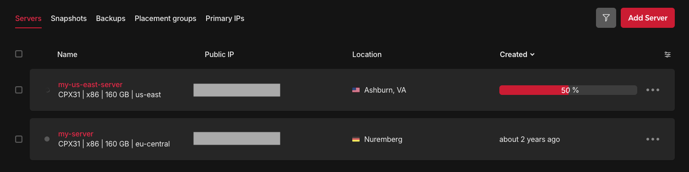

I'll keep this short and simple!

1. Power off server
2. Create snapshot
3. Create new server from snapshot
4. Update your DNS records to use new IP address

## Power your server off

Log into your Hetzner Console and find the server you want to relocate.

Go to the Power tab, and click on "Power off"

**NOTE**:

When your server is powered off, all your domains or services on the server will stop so you can't access it via the internet.

## Create snapshot

Then go to the "Snapshots" tab and click on "Take snapshot" to create a new snapshot.

This will take some time as Hetzner will create an image of your server. This does costs a bit depending on how big your server is.

## Create server from snapshot

Once your snapshot is completed, you can click on the more options button and see an option for "Create new Server".

This will then take your through the same steps of creating a new server i.e. hardware requirements, server location, etc.

Once that's done, click on "Create & Buy now" which then provision you a new server.

Hetzner will begin applying the snapshot to your new server.

## Update your DNS

Any domains or services that was tied to the old server's IP address must be updated with the new IP address.

Go to the DNS management for each one and you have to replace each old IP address with the new one.

Then visit your domains and see if they work.

## Remove old server

All that's left to do now is remove the old server. If you don't, you still incur monthly costs as you are "holding" a spot for your server.

## Conclusion

Well that was super simple, wasn't it? You should have a nice new server that is located closer to you and your users.

Thanks for reading and hope you have a good one!
