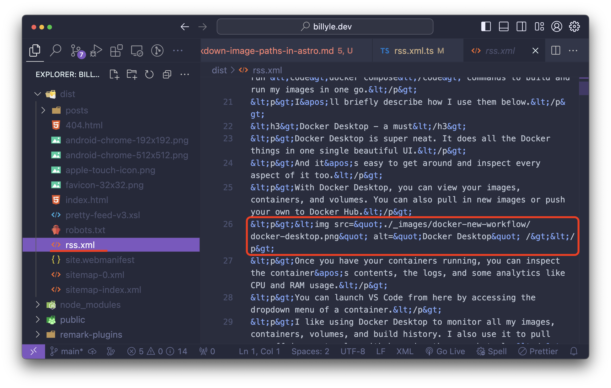
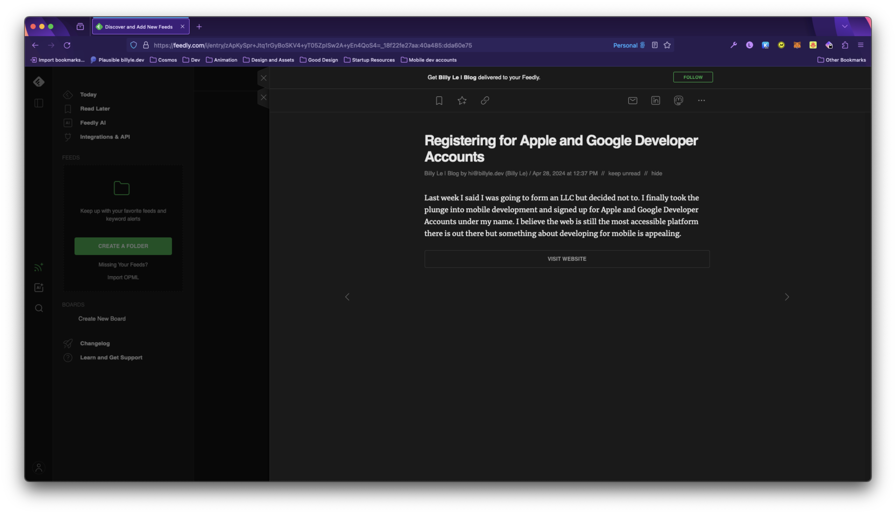
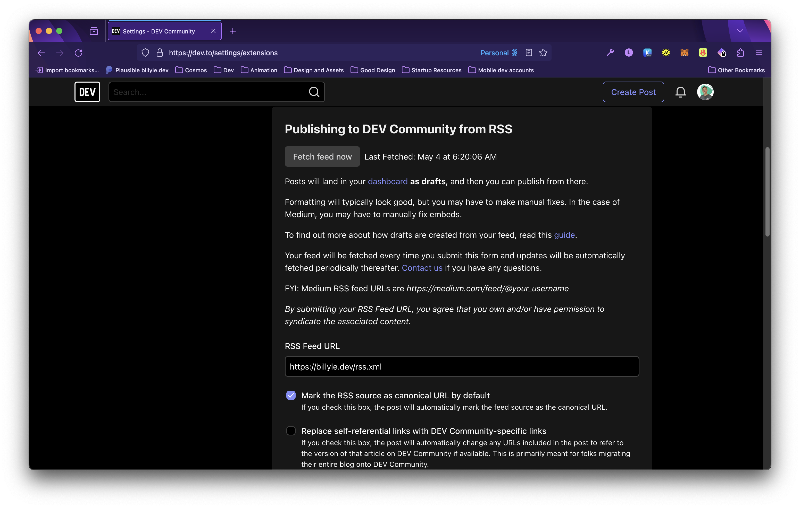
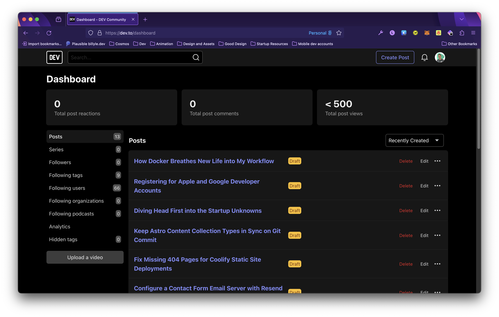
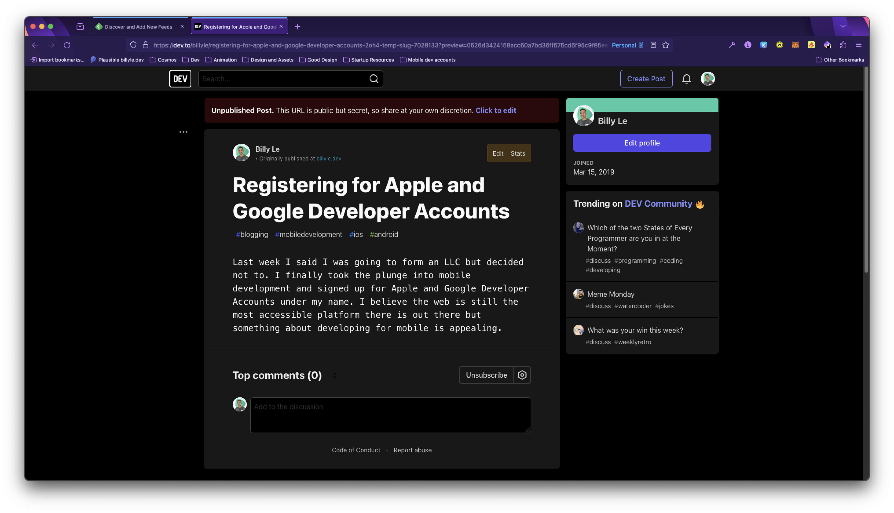
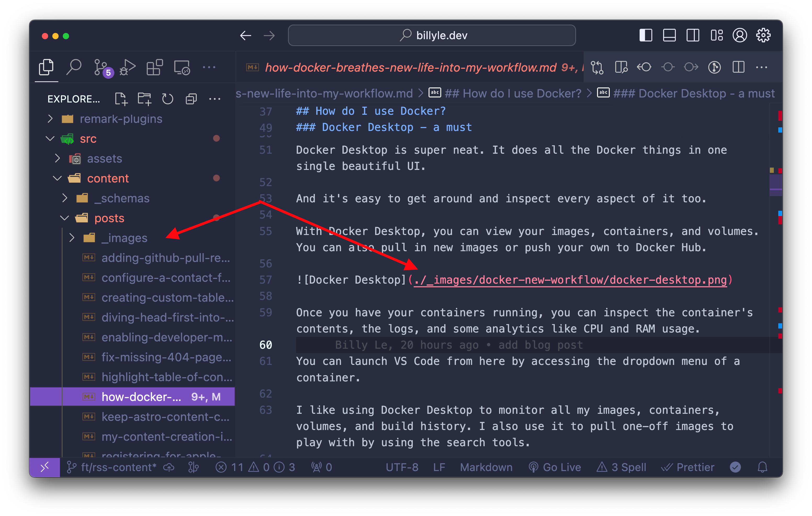
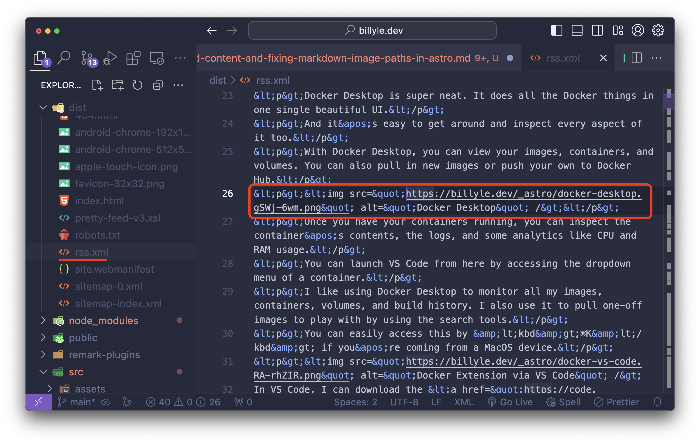
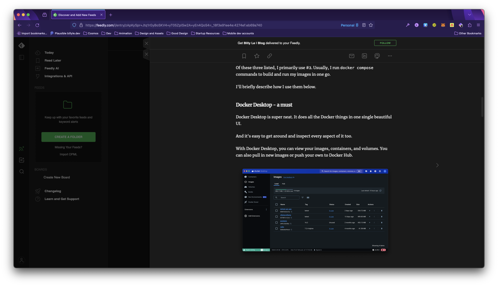
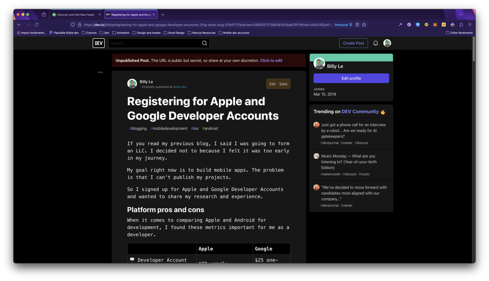

Having an RSS feed is a nice way to notify your readers when your new content has been published.

I have a yellow "Subscribe" button at the end of every blog post which points to my `rss.xml` file where anyone could subscribe using an RSS reader.

To do this, AstroJS makes it easy for you to [create an RSS feed](https://docs.astro.build/en/guides/rss/) by using their official plugin [@astrojs/rss](https://github.com/withastro/astro/tree/main/packages/astro-rss).

However, when it comes to adding feed content, there was one little problem...

## The RSS content image issue

When I first integrated it, I tried adding the full contents of my post to the RSS feed.

I realized the output image src were all using a relative path that didn't exist because of how Astro works with local images.



I couldn't find a direct fix for this initially so I put it off.

With that said, I excluded using the post content and simply used the title and description for my RSS feed.

Now, when I visit an RSS reader like [Feedly](https://feedly.com) and look for my website, I get a list of feeds.

It's exactly what I want, but it looks pretty bare-bones.



All a user can do at this point is to follow the link to visit the blog to read it.

But what if I want users to read from their preferred source?

Wouldn't it be nice if someone wanted to read on Medium, dev.to, or their own RSS reader?

That's why I found the want to add the post content and begin cross-posting to other platforms so that my blog has more reach.

## Cross-posting on dev.to

More recently, I wanted to cross-post over to dev.to to get more visibility on my writings.

You can connect your RSS feed to dev.to under "Settings -> Extensions".



If you want, you can specify to dev.to that you want your RSS feed to be the canonical URL. Be sure to check the box if this is your desire.

From there, you can click the "Fetch feed now" button and it will pull all your feed items into your dashboard as draft posts.



Everything works as expected but the contents of the blog weren't included because the RSS feed item didn't have any content that dev.to can use.



Before I get to the solution, I want to talk about how AstroJS outputs the image files.

## AstroJS image optimization

Let's understand a bit what is happening with the images in your markdown.

In this photo, you can see I have an `_images` folder alongside my markdowns that map to a relative path in a blog post.



If you're using an import alias or relative path that is not the public directory in your markdowns, Astro will copy and optimize the images and place them in a static folder called `_astro/` at build time.

When AstroJS is transforming your markdowns to HTML, it will then replace all the image paths with the one found in the `_astro` folder.

Here is an example of what that folder looks like.


By default, AstroJS will give the file names a hash and also convert it to `webp` for a smaller footprint.

Pretty simple, right?

Okay, it's time to revisit adding the RSS feed content.

## Building the RSS feed content

Using the AstroJS RSS tutorial as a base, we'll add onto it to make sure our images correctly point to a URL.

This is the basic code to compile your RSS feed.

```typescript
import rss from '@astrojs/rss';
import { getCollection } from 'astro:content';
import sanitizeHtml from 'sanitize-html';
import MarkdownIt from 'markdown-it';
const parser = new MarkdownIt();

export async function GET(context) {
  const blog = await getCollection('blog');
  return rss({
    title: 'Buzz’s Blog',
    description: 'A humble Astronaut’s guide to the stars',
    site: context.site,
    items: blog.map((post) => ({
      link: `/blog/${post.slug}/`,
      // Note: this will not process components or JSX expressions in MDX files.
      content: sanitizeHtml(parser.render(post.body), {
        allowedTags: sanitizeHtml.defaults.allowedTags.concat(['img'])
      }),
      ...post.data,
    })),
  });
}
```

In the `parser.render(post.body)`, we are passing in the contents of our markdown into render which includes the relative image paths.

That is why in our final output for our `rss.xml`, we get those incorrect URLs.

At this point, I had an idea to fix this. What if before I pass the HTML string into `sanitizeHtml()`, I modify the markdown or HTML image paths myself, would that work?

Let's see...

### Add dependency node-html-parser

We're going to need an HTML parser so we can easily manipulate objects instead of strings.

Install [node-html-parser](https://www.npmjs.com/package/node-html-parser).

The Node HTML parser will convert the string output from the rendered markdown from `markdown-it` and create a DOM-like HTML structure.

We can query against this structure like how we would use the DOM API for browsers.

Install it with your preferred package manager.

I use pnpm so that command would be `pnpm add node-html-parser`.

### The image relative path fix

Here is my solution to this problem.

```typescript
import rss from "@astrojs/rss";
import sanitizeHtml from "sanitize-html";
import MarkdownIt from "markdown-it";
import { allPosts } from "@utils/getCollection";
import { parse as htmlParser } from "node-html-parser";
import { getImage } from "astro:assets";

import type { AstroGlobal } from "astro";
import type { RSSFeedItem } from "@astrojs/rss";
const markdownParser = new MarkdownIt();

// get dynamic import of images as a map collection
const imagesGlob = import.meta.glob<{ default: ImageMetadata }>(
  "/src/content/posts/_images/**/*.{jpeg,jpg,png,gif}", // add more image formats if needed
);

export async function GET(context: AstroGlobal) {
  if (!context.site) {
    throw Error("site not set");
  }

  const feed: RSSFeedItem[] = [];

  for (const post of allPosts) {
    // convert markdown to html string
    const body = markdownParser.render(post.body);
    // convert html string to DOM-like structure
    const html = htmlParser.parse(body);
    // hold all img tags in variable images
    const images = html.querySelectorAll("img");

    for (const img of images) {
      const src = img.getAttribute("src")!;

      // Relative paths that are optimized by Astro build
      if (src.startsWith("./")) {
        // remove prefix of `./`
        const prefixRemoved = src.replace("./", "");
        // create prefix absolute path from root dir
        const imagePathPrefix = `/src/content/posts/${prefixRemoved}`;

        // call the dynamic import and return the module
        const imagePath = await imagesGlob[imagePathPrefix]?.()?.then(
          (res) => res.default,
        );

        if (imagePath) {
          const optimizedImg = await getImage({ src: imagePath });
          // set the correct path to the optimized image
          img.setAttribute(
            "src",
            context.site + optimizedImg.src.replace("/", ""),
          );
        }
      } else if (src.startsWith("/images")) {
        // images starting with `/images/` is the public dir
        img.setAttribute("src", context.site + src.replace("/", ""));
      } else {
        throw Error("src unknown");
      }
    }

    feed.push({
      title: post.data.title,
      description: post.data.description,
      author: `${post.data.author.email} (${post.data.author.name})`,
      pubDate: post.data.pubDate,
      categories: post.data.tags,
      link: `/posts/${post.slug}`,
      // sanitize the new html string with corrected image paths
      content: sanitizeHtml(html.toString(), {
        allowedTags: sanitizeHtml.defaults.allowedTags.concat(["img"]),
      }),
    });
  }

  return rss({
    title: "Billy Le | Blog",
    description:
      "My creative outlet is a reflection of the experiences I've encountered—whether in learning, facing setbacks, or achieving success—as a software developer.",
    site: context.site,
    items: feed,
    stylesheet: "/pretty-feed-v3.xsl",
    xmlns: {
      atom: "http://www.w3.org/2005/Atom",
    },
    customData: [
      "<language>en-us</language>",
      `<atom:link href="${new URL("rss.xml", context.site)}" rel="self" type="application/rss+xml" />`,
    ].join(""),
    trailingSlash: false,
  });
}
```

I littered the code with comments but I'll try to break this down to make more sense of it.

The most important part is the `import.meta.glob()`.

Thanks to Henri Fournier, from the Astro Lounge Discord Support Channel, for this tip.

You can read more about [dynamically importing your images](https://docs.astro.build/en/recipes/dynamically-importing-images/) and the `import.meta.glob()` in more detail.

The `imagesGlob` variable is an object that stores keys as the paths, and the values as dynamic import functions.

```
const imagesGlob = {
  '/src/content/posts/_images/content-collection-in-sync/types-to-any.png': [Function: /src/content/posts/_images/content-collection-in-sync/types-to-any.png],
  '/src/content/posts/_images/creating-toc/remark-toc-md.png': [Function: /src/content/posts/_images/creating-toc/remark-toc-md.png],
  '/src/content/posts/_images/creating-toc/remark-toc-static.png': [Function: /src/content/posts/_images/creating-toc/remark-toc-static.png],
  ...
}
```

Each dynamic import contains the `ImageMetadata` object which looks like this:

```typescript
export interface ImageMetadata {
    src: string;
    width: number;
    height: number;
    format: ImageInputFormat;
    orientation?: number;
}
```

With that ready to go, I loop over all my blog posts and convert them to HTML using the `node-html-parser`.

```typescript
const body = markdownParser.render(post.body);
const html = htmlParser.parse(body);
const images = html.querySelectorAll("img");
```

From there, I loop through the images and use the dynamic imports from `imagesGlob` to get the correct path from the `ImageMetadata`.

And that looks like this:

```typescript
const src = img.getAttribute("src")!;

if (src.startsWith("./")) {
  // remove prefix of `./`
  const prefixRemoved = src.replace("./", "");
  // create prefix absolute path from root dir
  const imagePathPrefix = `/src/content/posts/${prefixRemoved}`;

  // call the dynamic import and return the module
  const imagePath = await imagesGlob[imagePathPrefix]?.()?.then(
    (res) => res.default,
  );

  if (imagePath) {
    const optimizedImg = await getImage({ src: imagePath });
    // set the correct path to the optimized image
    img.setAttribute(
      "src",
      context.site + optimizedImg.src.replace("/", ""),
    );
  }
}
```

The rest of the `else if/else` statements check if the image is from my public/images directory or if it's an unknown source, I throw an error.

Finally, I push the feed item into an array and when we sanitize our HTML, we call `html.toString()` which is passed into `sanitizeHtml()`.

### Check RSS output fix

Now it's time to see if everything works.

Run the build command, I'm using `pnpm build`.

Check the contents of your `_dist` folder and look for your RSS XML file.



🥳 Yes! It's looking good and seems to be pointing to the path correctly.

Okay, time to push it live and test Feedly and dev.to.

## Verify fix on supported platforms

If you had an RSS feed on Feedly before adding content, they won't update as the [date is encoded on their servers](https://groups.google.com/g/feedly-cloud/c/3evZeYOnS2I).

Only new content will be updated with the new RSS changes or when you change your feed URL.

Viewing from Feedly, I only have one item that correctly shows the contents of my blog post.

And the images are working!



That's awesome!

Over on dev.to, I deleted all my drafts with no content.

Once I removed all my old draft posts, I fetched my updated RSS feed using the "Fetch feed now" button.

And now, I see that all the contents are there ready to be published!



## Conclusion

With the RSS feed content in place, we can now fetch our blog posts on platforms that support RSS feeds.

This is great because we can benefit by sharing our blog with different platforms and give our readers a choice where they receive updates and read new content.

In this post, I've gone over the issue of the incorrect image path when creating an RSS feed from markdown to XML with AstroJS.

To fix this, we had to convert the markdown to HTML and modify the image src to use the correct path. That's all thanks to the `import.meta.glob()`, a useful Vite utility function.

After verifying our fix, we can view places like Feedly and dev.to, to continue sharing our posts.

If you want to see how you can add a featured image per blog post for your RSS. Check out [Web Reaper's blog post](https://webreaper.dev/posts/astro-rss-feed-blog-post-images/) on how you can do that.

Well, that's all I can think of. Let me know what you think and if there is anything I can add.

Thanks for reading, and as always, have a good one! 😊
