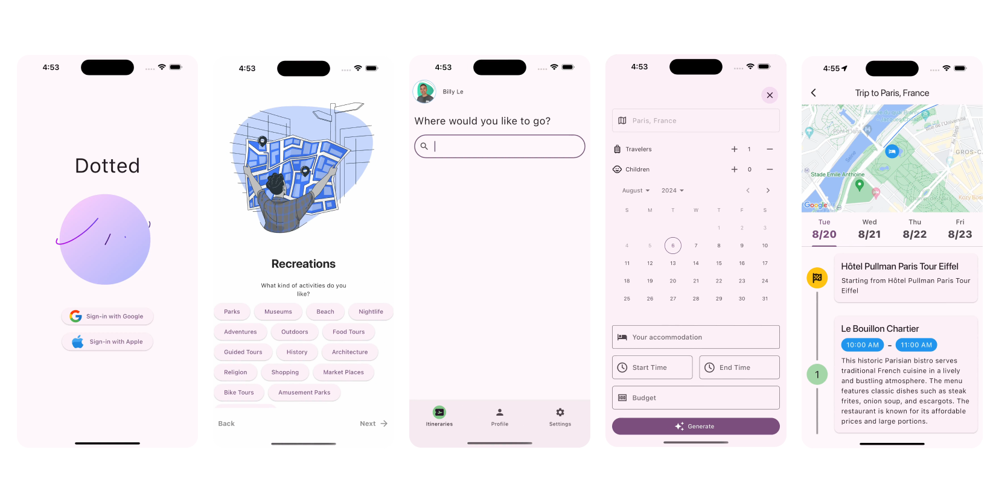
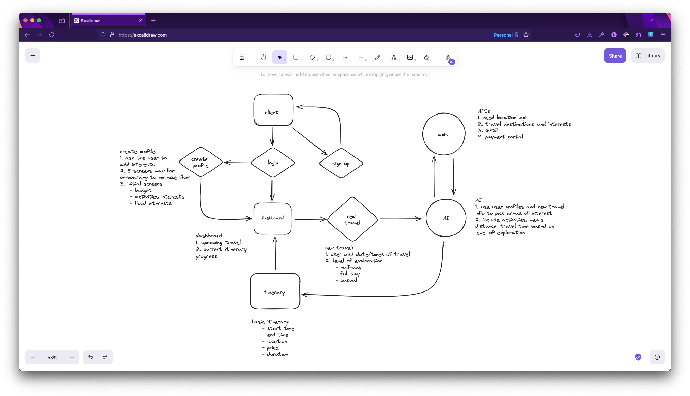
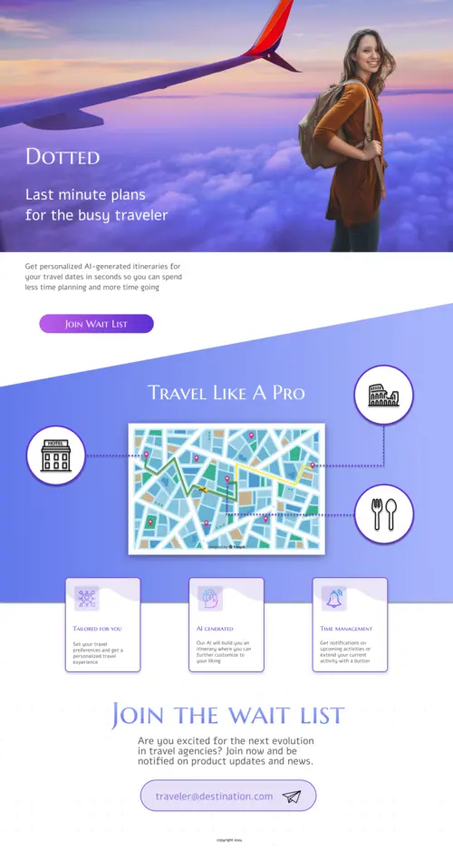
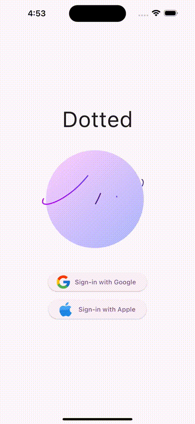
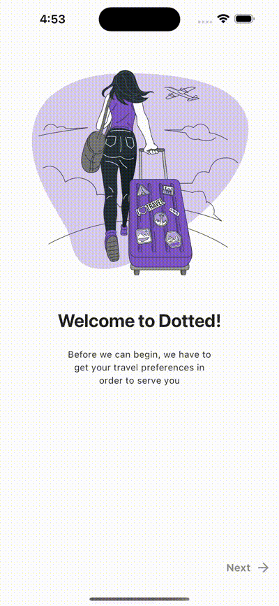
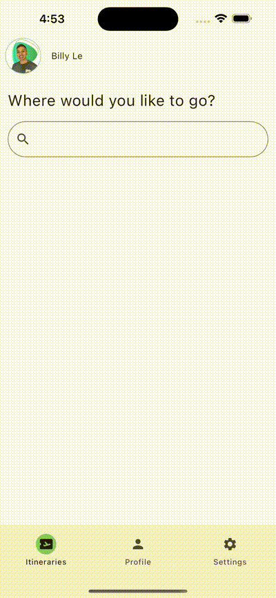
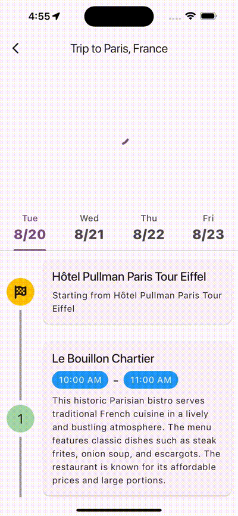

## Introduction

### Project Overview

Dotted is a travel AI mobile application built with Flutter, Supabase, and Node. he product was intended to be released on iOS and Android platforms, with a website launch planned if things went well.

Here is a snapshot of all the screens that were created in this project.

### Objective

There were main three objectives:

1. Utilize AI to generate itineraries while keeping costs low
2. Launch the app before the summer where the traveling industry starts to picks up
3. Profit

## Challenges

### Initial Challenges

There were quite a few challenges from the get go.

I had zero experience in mobile and AI app development so learning new languages and frameworks was rather difficult.

Hardware limitations were another impediment since I was developing on a base model MacBook Air M1 where running iOS simulations would hog up resources and I couldn't run any local LLMs.

I partnered up for this project with a friend who had a full-time role. Among his work, life and this project, he had to find time to contribute.

### Project Scope

We wanted to create an MVP where a user can sign up and generate an itinerary. The generated itinerary could then be viewed by the user, showing a schedule by day.

The following diagram shows the flow of the application in it's most basic form.

## Research and Planning

### Market Research

I scoped out the competition and found many companies already implementing AI to generate itineraries.

The companies were offering either a mobile app or a web app but not both. The way they approached their product was similar to ours but I did find a unique product where the product is an AI chatbot.

We also read a white paper on the use of AI in the travel industry but we discovered that we were not mathematicians.

### Planning

I'm no designer by trade but I did design the market landing page where users could be added to a waitlist.

For typography, I chose Marcellus SC for headings and Alef for content. It felt right to me at the time.

The primary color is a sunset purple(?). I wanted to convey the feeling of awe that I feel when I see a beautiful sunset.

It's mesmerizing to look up at that and I wanted to translate that into traveling.

For the mobile app design, I didn't really touch it and used a lot of references from Behance and Dribbble.

### Technology Stack

Much of the tech stack I chose was new to both me and my partner. I made all the choices because I wanted to learn something new.

I wanted to use a cross-platform tool so I chose Flutter. The reason why I chose Flutter over React Native is because I heard Flutter was more performant.

Here is a list of all the tech used:

1. Flutter / Dart
2. Supabase / Postgres
3. Node
4. Redis
5. Docker - containerized the backend which includes Node and Redis
6. SQLite for caching destinations on the phone
7. Google Gemini Pro and Google Maps
8. Unsplash API

## Development Process

### Design Phase

I approached designing the core business logic and entities by starting with the customer.

We know that we wanted to create a profile of the user's preference and use that data to generate a personalized experience.

Our solution to that was to make the user select their preferences on the onboarding screen.

Accompanying that data is the user's destination, their accommodations, budget, and the time they want to start and end the itinerary.

Any generated itinerary needed a cover image which we pulled in from Unsplash.

Finally, the user can view their itinerary by tapping on any upcoming / on-going itineraries on the main page.

### Development Phase

I started working on the front-end first before the back-end. There were a lot of tutorials for Flutter and Supabase on how to set up a project fast.

Developing the Flutter application was not super difficult as it felt very similar to React in terms of rendering and passing "props".

For the back-end, I switched between various technologies because I ran into skill issues. I tried using BentoML, then OpenLLM, and then Ollama, which, in most ways, failed me.

I then tried using AI providers like Groq and liked it very much but when I introduced AI agents, I was hitting the rate limiting pretty fast so I had to use something easier.

Since then, I chose Google Gemini Pro. It was mostly free to use, almost no rate limiting and I could pass in a big context if I wanted to.

On the backend, I chose Node and whenever the mobile app sent a request to create an itinerary, the payload would be queued in a Redis Message Queue.

The Message Queue would pick up jobs and make the call to Gemini for the itinerary and the result of that would be parsed and saved into Supabase.

### Iterations

There a few iterations to how the AI was being generated as described above. I also changed the models quite often as I discovered properties that I needed and no longer needed.

## Solution

The final solution was a mobile app that worked on iOS and Android simulators.

Here are the 4 core functionalities that were implemented in this project.

### Auth

### On-Boarding

### Generate Itinerary

### View Itinerary

## Conclusion

Overall, the project was quite challenging and took more than 4 months to complete the MVP.

I learned a great deal while working on Dotted and I will continue to develop my skills in this tech stack.

In regards to the project, I think I would not continue to pursue the idea.

AI is great but it's also predictable and unpredictable at the same time.

Inputting the same destination would give you the same itinerary, even if the temperature changed.

Additionally, Google Gemini could change the way their models work at any moment.

I like the idea of using AI to generate itineraries but don't think it's ready for me.

## Appendix

[Source code](https://github.com/dotted-earth)
