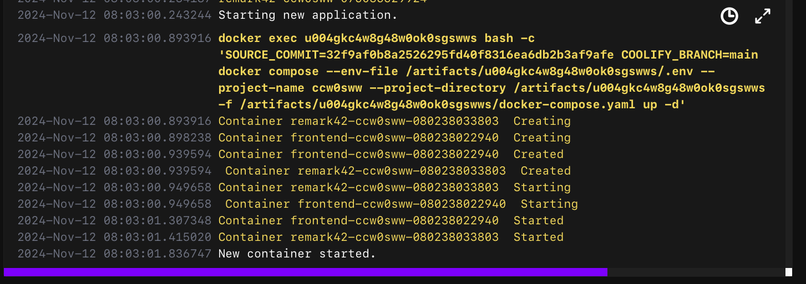

If you're looking to engage with your readers through comments on your website, this guide will help you get started.

You'll also gain other benefits such as:

- Community building. Your readers will know each other and you'll learn more about them.
- Increased SEO from readers who provide additional content, feedback, questions, and their opinions.
- Better user experience since readers don't need to leave your site if they want to contact you.

One downside to all of this? Well, it can be tricky to set up.

The Remark42 documentation recommends using a subdomain which looks like:

```bash
www.remark42.yourwebsite.com
```

But I'm going deploy Remark42 as a path on my website like:

```bash
www.yourwebsite.com/remark
```

Here is the [official docs on setting Remark42 up without a subdomain](https://remark42.com/docs/manuals/subdomain/).

There are pros and cons to each but I won't go into that.

In this tutorial, I'll walk you through setting it up.

## Comment engines

You may be shopping around for a comments engine and stumbled upon a few like Disqus and Giscus.

They both offer exceptional services but one is paid and the other only allows auth via Github.

I wanted something free and have a robust authentication flow.

The tool of choice?

[Remark42](https://www.remark42.com).


It's a comment engine that is privacy focused and it supports many common authentication providers.

And if you decide you want to ditch OAuth, you can have people login via email or anonymously.

Here's a non-exhaustive list of other cool features Remarks provides out-of-the-box:

- Multi-level nested comments with both tree and plain presentations
- Import from Disqus and WordPress
- Markdown support with friendly formatter toolbar
- Moderators can remove comments and block users
- Voting, pinning and verification system
- and much more...

Check out their website for additional details or visit their [demo](https://remark42.com/demo/) to get a feel for it.

## Hardware requirements

I assume you already have a VPS, Coolify installed, and a domain like `www.yourwebsite.com` already configured.

Well, if don't have none of these? Refer to my guide!

- [Self-hosting Your Website with Coolify v4: A Step-by-Step Guide](/posts/self-hosting-your-website-with-coolify-v4-a-step-by-step-guide)

Remark42 doesn't take much resources. From my estimation, the minimum specs you will need alongside Coolify is:

- 2 CPU cores
- 4 GB of RAM
- 1TB+ of Storage

If you plan to deploy multiple application and services, you're going to want more power.

I'm currently running on a 4 CPU/8GB of RAM with 160GB of storage setup on Hetzner where I have about 10 apps deployed.

## Software Requirements

In order for this to work with any frontend project, we're going to need Docker.

The easiest way to install Docker is to download the [Docker Desktop](https://www.docker.com/products/docker-desktop/).

It comes bundled with everything you need to get going.

There are 3 files we're going to create that makes this whole thing work:

- Dockerfile
- docker-compose.yaml
- nginx.conf

The `Dockerfile` are instructions to tell Docker how to build our frontend image.

The `docker-compose.yaml` tells Docker how to find or build images and then run them in containers.

The `nginx.conf` is a configuration file for our reverse proxy server so it can properly serve the files from our containers.

Tying them together is Docker where it will build and deploy a frontend, Remark42, and an nginx server.

## Prepping Remark42

### Choose auth(s)

Before we configure Remark42, you need to figure out how you want your readers to log in to leave comments.

What would you like readers to do?

- Post anonymously?
- Log in via email and password?
- Use OAuth providers like Google?

Well, you can actually use a combination of these.

I personally chose a few OAuth providers because it's more secure, prevent spam, and sensitive info is not stored.

If you want to use OAuth providers, you'll have to set those up beforehand to get the client ids and secrets for later in this tutorial.

I won't be showing you how to do that but I found that the Github is the easiest to get started.

Refer to this [documentation on getting OAuth client ids and secrets](https://remark42.com/docs/configuration/authorization/) for common providers.

For each OAuth provider you choose, you must provide the correct callback so Remark42 can properly handle request from the providers.

The callback URL looks like:

```plaintext
https://yourwebsite.com/remark/auth/<provider>/callback
```

For local development, use:

```text
http://127.0.0.1:<port>/remark/auth/<provider>/callback
```

** NOTE ** Not all providers will allow localhost development.

### Notifications

Remark42 can enable notifications whenever someone leaves a comment.

The available options are: Slack, email, and Telegram.

I've chose Telegram because it's incredibly easy to set up.

You need [a Telegram account](https://telegram.org) to get an API Key.

Once you do that, you'll have to message `@BotFather` with `/newbot`

Follow the instructions to give a display name and username your bot.

I've chose `billyle.dev comments` as my display name and the username of `billyle_dev_comments_bot`.


You will receive a API token where the red bar is in the above image.

We will use this value in our `.env` file.

We need to create a private channel and invite the bot to our private channel.

All channels created are private by default.

To create a channel, follow these [instructions](https://telegram.org/faq_channels#q-what-39s-a-channel) for your device.

Now it's time to get the channel id which is a bit tricky.

I found the easiest way is to login to Telegram from a web browser to retreive it.


After getting the channel id, you will have to prefix it with `-100`.

In the example above, our actual channel id is: `-1002460468573`.

Now to invite our bot to our channel, follow these steps:

1. Go to your private channel, find the "Admins" button and click on "Add Admin".
2. Click on the channel's avatar icon.
3. Find the "Administrators" button and click that.
4. Click on "Add Admin"
5. Type in your bot's username and click on it
6. Set the permissions for your bot to only have "Post" privileges.
7. Click "Done"

You should now see two Administrators for your channel - yourself and your newly created bot.

With that out of the way, we can now move on to the coding aspect of this tutorial.

## Project setup

Our next step is to navigate to the root of your frontend project.

For example, this website's file structure looks like this:

```bash
.
├── astro.config.ts
├── dist
├── docker-compose.yaml
├── Dockerfile
├── nginx.conf
├── node_modules
├── package.json
├── pnpm-lock.yaml
├── postcss.config.mjs
├── public
├── README.md
├── remark-plugins
├── src
├── tailwind.config.mjs
├── tsconfig.json
└── unstage-drafts.ts
```

It's a simple project but no matter how complex your frontend is, ideally the core concepts of this should work the same.

Let's move on to the `.env` file.

### .env file

Create an `.env` file in the root of your frontend project.

In this file, add all the environment variables for the authentication methods.

```dotenv
PUBLIC_REMARK_URL=https://yourwebsite.com/remark
PUBLIC_SITE=my_website
REMARK_SECRET=superSecret123
REMARK_ALLOWED_HOSTS="'self',https://yourwebsite.com"
ADMIN_SHARED_ID=
AUTH_GOOGLE_CID=
AUTH_GOOGLE_CSEC=
AUTH_GITHUB_CID=
AUTH_GITHUB_CSEC=
TELEGRAM_TOKEN=
NOTIFY_TELEGRAM_CHAN=
```

The `PUBLIC_REMARK_URL` and `REMARK_SECRET` are required by Remark42.

The public remark url should look like `http://yourwebsite.com/remark`.

This value will be used for both the frontend and remark service.

The `PUBLIC_SITE` is a custom name field. By default it is `remark` but I chose a meaningful name like `billyle_dev`

The `REMARK_ALLOWED_HOSTS` will be the value of `"self,https://yourwebsite.com"`.

Doing it this way will give us extra security that only requests from our domain is authorized to make requests.

Add the rest of the key value for your chosen auth providers and Telegram configuration.

With that out of the way, let's create our `Dockerfile`.

### Dockerfile

If you're using Astro, this Dockerfile example will work for you with little adjustments.

But if you're using another framework like NextJS, Solid, Vue, etc. you'll have to look up how to create a Dockerfile for them.

At the root, create the file.

```bash
touch Dockerfile
```

And then copy this if your using Astro.

```docker
# syntax=docker/dockerfile:1

ARG NODE_VERSION=lts
ARG PNPM_VERSION=9.12.3

FROM node:${NODE_VERSION}-alpine AS base
WORKDIR /usr/src/app
RUN --mount=type=cache,target=/root/.npm \
    npm install -g pnpm@${PNPM_VERSION}
COPY package.json pnpm-lock.yaml ./

FROM base AS prod-deps
RUN pnpm install --prod --frozen-lockfile

FROM base AS build-deps
RUN pnpm install --frozen-lockfile

FROM build-deps AS build
ARG PUBLIC_REMARK_URL
ARG PUBLIC_SITE
ENV PUBLIC_REMARK_URL=${PUBLIC_REMARK_URL}
ENV PUBLIC_SITE=${PUBLIC_SITE}
COPY . .
RUN --mount=type=cache,target=/usr/src/app/node_modules/.astro \
    --mount=type=cache,target=/root/.astro/cache,sharing=locked \
    mkdir -p node_modules/.astro && \
    pnpm run build

FROM base AS runtime
COPY --from=prod-deps /usr/src/app/node_modules ./node_modules
COPY --from=build /usr/src/app/dist ./dist

FROM nginx:stable-alpine3.17 AS final
COPY nginx.conf /etc/nginx/nginx.conf
COPY --from=build /usr/src/app/dist /usr/share/nginx/html
EXPOSE 4321
```

I won't explain too much but in this `Dockerfile`, we're creating a multi-stage process to take advantage of Docker's caching.

We want to make our builds fast so we split up different parts of the build process.

For example, in the first step we copied the `package.json` and `pnpm-lock.yaml` files and it gets cached by Docker.

Then in the next few steps, Docker only run `pnpm install` if the two files has changed, otherwise, we reach for what's been cached.

If you want to find out more about this, read the docs on [Docker build cache
](https://docs.docker.com/build/cache/).

Another important note is how we create environment variables.

The `ARG` values will be passed into our `Dockerfile` and set our `ENV` variable from Docker Compose.

In turn, the `ENV` will be used in the build process for the frontend.

Once that's complete, we'll move on to creating the `docker-compose.yaml`.

### docker-compose.yaml

At the root, create the file from the terminal.

```bash
touch docker-compose.yaml
```

Copy the code below. Make adjustments to both the `frontend` and `remark` service to your project.

```yaml
services:
  frontend:
    build:
      context: .
      dockerfile: Dockerfile
      args:
        PUBLIC_REMARK_URL: ${PUBLIC_REMARK_URL}
        PUBLIC_SITE: ${PUBLIC_SITE}
    container_name: "frontend"
    ports:
      - "4321:4321"
    expose:
      - "4321"
    networks:
      - app
    environment:
      - PUBLIC_REMARK_URL=${PUBLIC_REMARK_URL}
      - PUBLIC_SITE=${PUBLIC_SITE}
    env_file:
      - .env
  remark42:
    image: umputun/remark42:latest
    container_name: remark42
    hostname: remark42
    restart: always
    logging:
      driver: json-file
      options:
        max-size: "10m"
        max-file: "5"
    ports:
      - "8081:8080"
    networks:
      - app
    environment:
      - REMARK_URL=${PUBLIC_REMARK_URL}
      - SITE=${PUBLIC_SITE}
      - SECRET=${REMARK_SECRET}
      - ADMIN_SHARED_ID=${ADMIN_SHARED_ID}
      - AUTH_GOOGLE_CID=${AUTH_GOOGLE_CID}
      - AUTH_GOOGLE_CSEC=${AUTH_GOOGLE_CSEC}
      - AUTH_GITHUB_CID=${AUTH_GITHUB_CID}
      - AUTH_GITHUB_CSEC=${AUTH_GITHUB_CSEC}
      - AUTH_TELEGRAM=true
      - NOTIFY_ADMINS=telegram
      - TELEGRAM_TOKEN=${TELEGRAM_TOKEN}
      - NOTIFY_TELEGRAM_CHAN=${NOTIFY_TELEGRAM_CHAN}
      - ALLOWED_HOSTS=${REMARK_ALLOWED_HOSTS}
    env_file:
      - .env
    volumes:
      - remark42:/srv/var

networks:
  app:

volumes:
  remark42:
```

Refer to the [backend configuration](https://remark42.com/docs/configuration/parameters/) to view all the available options.

There are quite a few things going on in this file.

1. We created two services, `frontend` and `remark`, each with their own configurations.
2. We are pulling in environment variables from `.env` with the `env_file`.
3. We mapped ports of both services to communicate with the host.
4. We created a network called `app` so these two containers can talk to each other.
5. Finally, we created a volume for remark to store our comments.

One thing to note is that our `frontend` service is using a `build: .` while our `remark` service doesn't.

# NGINX config

Now create another file at the root of your project called `nginx.conf`

```bash
touch nginx.conf
```

Here is a template you can use for an Astro project.

For other frameworks, you'll have to look it up to get it right.

```nginx
worker_processes  1;

events {
  worker_connections  1024;
}

http {
  server {
    listen 4321;
    server_name _;

    root   /usr/share/nginx/html;
    index  index.html index.htm;
    include /etc/nginx/mime.types;

    gzip on;
    gzip_comp_level 5;
    gzip_min_length 1024;
    gzip_proxied any;
    gzip_types text/plain text/css application/json application/javascript application/x-javascript text/xml application/xml application/xml+rss text/javascript application/font-woff application/font-woff2 image/svg+xml;

    client_max_body_size 10M;
    client_body_timeout 12;
    client_header_timeout 12;
    send_timeout 10;
    keepalive_timeout 65;

    add_header X-Content-Type-Options nosniff;
    add_header X-Frame-Options DENY;
    add_header X-XSS-Protection "1; mode=block";

    error_page 404 /404.html;
    location = /404.html {
      root /usr/share/nginx/html;
      internal;
    }

    error_page 500 502 503 504 /50x.html;
    location = /50x.html {
        root /usr/share/nginx/html;
        internal;
    }

    location / {
      try_files $uri $uri/index.html =404;
    }

    location /remark/ {
      rewrite /remark/(.*) /$1 break;
      proxy_pass http://remark42:8080/;
      proxy_set_header Host $http_host;
      proxy_set_header X-Real-IP $remote_addr;
      proxy_set_header X-Forwarded-For $proxy_add_x_forwarded_for;
      proxy_set_header X-Forwarded-Proto $scheme;
    }
  }
}
```

In this configuration, we're setting up our server to listen on port 4321 and respond to each path.

The `Dockerfile` we created before, will copy this config into the nginx container.

The important detail lies with the `/remark/` path which will proxy all requests from `https://yourwebsite.com:4321/remark/*` to the Remark42 service on port 8080 that we created in the `docker-compose.yaml` file.

Later on, we'll add some more configuration to disable the demo page.

### Frontend setup

All we need to do now is tell where Remark42 to render on the frontend.

We will have to create a global variable called `remark_config` and pass it some configurations and when the page loads, we'll invoke a function to make a request to our `remark42` server.

I created a component for this in Astro and you can do something similar in React or vanilla JS.

Create a file called `Remark42.astro` if you're using Astro and use the following:

```astro
<script>
  var remark_config = {
    host: import.meta.env.PUBLIC_REMARK_URL,
    site_id: import.meta.env.PUBLIC_SITE,
    components: ["embed"],
    theme: window.localStorage.getItem("theme") ?? "dark",
    locale: "en",
    show_email_subscription: true,
    show_rss_subscription: false,
    no_footer: true,
    __colors__: {},
  };

  window.remark_config = remark_config;

  function createRemark42Script(components: string[], doc: Document) {
    for (let i = 0; i < components.length; i++) {
      let scriptEl: HTMLScriptElement = doc.createElement("script");
      let ext = ".js";
      let headOrBodyEl = doc.head || doc.body;

      if ("noModule" in scriptEl && !scriptEl.noModule) {
        scriptEl.type = "module";
        ext = ".mjs";
      } else {
        scriptEl.async = true;
        scriptEl.defer = true;
      }

      scriptEl.src = `${window.remark_config.host}/web/${components[i]}${ext}`;
      headOrBodyEl.appendChild(scriptEl);
    }
  }
  if ("remark_config" in window) {
    window.addEventListener("DOMContentLoaded", () => {
      createRemark42Script(
        window.remark_config.components || ["embed"],
        document,
      );
    });
  }
</script>

<section id="remark42"></section>
<noscript
  >Please enable JavaScript to view the comments powered by Remark42.</noscript
>
```

In our script tag, the `remark_config` requires the `remark_url` and `site_id`.

Those values will come from our `.env` file that we passed as `ARG` into the `frontend` service in Docker Compose.

The `remark_config` will be attached to the window as a global variable which will be used by the `createRemark42Script`.

To look up more configuration options, look at the [frontend guide](https://remark42.com/docs/configuration/frontend/).

Lastly, we need an HTML element to render our Remark42 component.

Add a container with the id of `remark42` and place it where you want it to render.

```html
<section id="remark42"></section>
```

Add a `<noscript>` tag if you want. It's optional.

The 3 files - `Dockerfile`, `docker-compose.yaml`, and `nginx.conf` - have been created. Let's try running it now!

### Running the services

Okay now we're finally here!

Now we can test if things are working.

In the terminal run this command:

```bash
docker compose up --build
```

You should see the Docker pulling and building images as such:


Hopefully everything builds without error and you should now see two servers running - `frontend` and `remark42`.

To test, goto the frontend by using `127.0.0.1:$PORT/remark/web` where `$PORT` is your port number.


You should see the requests being made to your frontend and remark services like the ones above.

If you have trouble, stop the containers and debug press <kbd>CTRL</kbd> + <kbd>C</kbd> followed by:

```bash
docker compose down
```

If all is well, you should be on the remark demo page hosted on your site!

### Become an admin

Decide an authentication provider to login as admin because you'll be using that user's id.


If you setup your OAuth correctly, you should be able to login and return back to your website.

I'm using Github to login as admin and after completing the login, I see my avatar.

Click on your avatar and you should see your id in the sidebar that pops open.


Copy the id and paste it in your `.env` for the `ADMIN_SHARED_ID=` field.

Restart the containers by using <kbd>CTRL</kbd> + <kbd>C</kbd> and then run:

```bash
docker compose down
```

Run `docker compose up --build` and revist the page and you should now see a "Show Settings" option which signifies you're an admin user.

If everything is good-to-go, merge it into your main branch and push it to your remote repository.

Your existing frontend shouldn't be affected since we haven't changed the "Build Pack" in Coolify and your existing Coolify build should continue running the build command as before.

## Deploy on Coolify

### Project config

Go to your admin instance of Coolify and navigate to where your frontend project is deployed.

Change the "Build Pack" option to "Docker Compose".

Coolify will load your `docker-compose.yaml` file and now you should see two fields under `Domains` with the names related to our services.

Add the port number of your frontend application from your `nginx.conf` to your domain.

```plaintext
https://yourwebsite.com:4321
```


And click on "Save" so that the configurations are loaded.

You should see in the generated Coolify labels the reverse-proxy ports:


### Environment Variables

Click on the "Environment Variables" tab, click on "Developer View", and then enter all the values from your `.env`


Click save to persist the values.

### Deployment

Let's deploy our application with our new configuration. Click on "Redeploy" and watch the build.

It may take a while depending the size of your project since this will be the first time Docker Compose is building your images.

Once it's complete, you should see your services has started and a "New container started".



Navigate to your website where the Remark42 will be rendered and try logging in with the same Auth you've used for admin.

Hopefully it all works and now you can leave a comment and see a notification from Telegram.


## Summary

Congrats! You've finally go Remark42 deployed on your website without a subdomain.

We've covered a lot of ground but hopefully it was worth it.

Your readers can now leave comments!

So, to summarized, we talked about the hardware and software requirements, and setting up our project for success.

After we coded up all the necessary bits, we learned how to deploy it on Coolify.

If you had any trouble with this tutorial, please leave a comment or if you found this helpful leave a thanks!

Until next time, happy coding!
