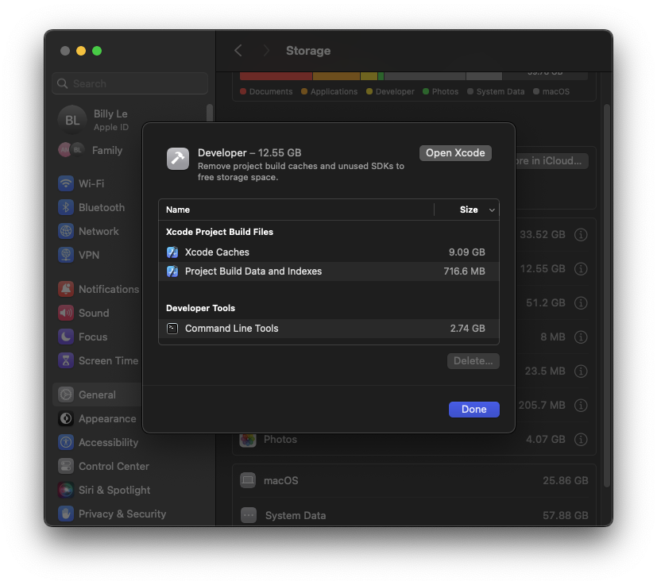

I started learning Flutter this year to expand into different areas of development.

Because I'm new, I don't know my way around the ecosystem yet. Some minor setbacks are not unusual whenever I'm coming to a new technology or programming language.

Flutter can be frustrating in the beginning, but once you're around the bend, it becomes easier to work with.

I'm here to share with you some common errors that kept popping up and how I was able to fix them.

I plan on keeping this list updated as I learn.

## Installation problems and fixes

I found that installing manually by downloading a zip file gave me fewer errors than doing the installation via VSCode.

I don't remember all the details but somehow the PATH didn't register correctly. Whenever I ran, `dart run build_runner build -d`, to generate code, I received errors and I couldn't figure it out even though `flutter doctor -v` gave me all green check marks.

Somewhere along the way, the `dart` executable wasn't in my path and unsure where it exists.

So if you're starting your journey with Flutter, I suggest installing by downloading the zip file and carefully following the instructions.

## Cocoapods errors

Cocoapods is a dependency manager used by Xcode and it's a requirement if you plan to build any apps for Apple.

This section is dedicated to some issues I ran into when working with Flutter.

### Cocoapods not installed error

This one was quite frustrating and recurring.

```
Launching lib/main.dart on iPhone 15 Pro Max in debug mode...

Warning: CocoaPods not installed. Skipping pod install.

CocoaPods is used to retrieve the iOS and macOS platform side's plugin code that responds to your plugin usage on the Dart side.

Without CocoaPods, plugins will not work on iOS or macOS.

For more info, see https://flutter.dev/platform-plugins

To install see https://guides.cocoapods.org/using/getting-started.html#installation for instructions.

CocoaPods not installed or not in valid state.

Error launching application on iPhone 15 Pro Max.

Exited (1).
```

You can check if Cocoapods is installed by running `gem list | grep cocoapods`.

```
cocoapods (1.15.2)
cocoapods-core (1.15.2)
cocoapods-deintegrate (1.0.5)
cocoapods-downloader (2.1)
cocoapods-plugins (1.0.0)
cocoapods-search (1.0.1)
cocoapods-trunk (1.6.0)
cocoapods-try (1.2.0)
```

If you see Cocoapods listed there then the issue is not with the installation.

Here are some possible fixes:

1. Restart VSCode. You need to completely close all VSCode instances before opening the text editor again.
2. Reinstall Cocoapods:

   - run `sudo gem uninstall cocoapods`. Select all versions.
   - after uninstall is complete, run `sudo gem install -n /usr/local/bin cocoapods`

3. If using a Ruby Version Manager like `rbenv`:

   - list all available Ruby version `rbenv install -l`
   - install the latest Ruby version: `rbenv install 3.3.0`
   - set global to 3.3.0 with `rbenv global 3.3.0`
   - make sure the `.rbenv/bin` and `.rbenv/shims` are available to your PATH
   - run `gem install bundler`
   - perform option 2 again

### Cocoapods base configuration

```
[!] CocoaPods did not set the base configuration of your project because your project already has a custom config set. In order for CocoaPods integration to work at all, please either set the base configurations of the target `Runner` to `Target Support Files/Pods-Runner/Pods-Runner.profile.xcconfig` or include the `Target Support Files/Pods-Runner/Pods-Runner.profile.xcconfig` in your build configuration (`Flutter/Release.xcconfig`).
```

To fix this issue, you'll need to modify two files where you'll remove the `?` from `#include?` statement.

1. In `ios/Flutter/Debug.xcconfig`:

```
#include "Pods/Target Support Files/Pods-Runner/Pods-Runner.debug.xcconfig"
#include "Generated.xcconfig"
```

2. In `ios/Flutter/Release.xcconfig`:

You're going to add an extra `#include` here for the `profile.xcconfig`

```
#include "Pods/Target Support Files/Pods-Runner/Pods-Runner.release.xcconfig"
#include "Pods/Target Support Files/Pods-Runner/Pods-Runner.profile.xcconfig"
#include "Generated.xcconfig"
```

## Target versions not supported

You might run into this issue when the version of your target platform isn't supported by a 3rd-party library that you've installed.

Here are some examples of what that might look like:

```
uses-sdk:minSdkVersion 16 cannot be smaller than version 23 declared in library [:audioplayers]
```

or

```
warning: The iOS Simulator deployment target 'IPHONEOS_DEPLOYMENT_TARGET' is set to 11.0, but the range of supported deployment target versions is 16.0 to 17.0. (in target 'firebase_core' from project 'Pods')
```

What you need to do is modify your targets for each platform you're deploying to. In my case, for Android and iOS, I edited these two files to set the `minSdkVersion` and the `platform :ios`.

In `android/local.properties` file, add the `flutter.minSdkVersion` on a new line and set it to the version you need.

```
flutter.minSdkVersion=21
```

For iOS, goto `ios/Podfile` file and uncomment where it says, `platform :ios, '<version>'` and specify the version.

```
# Uncomment this line to define a global platform for your project
platform :ios, '16.0'
```

If you're deploying to other platforms, say Windows or macOS, you will need to search the internet on how to update those values.

## Launch the simulator from VS Code

This one was a bit tricky. When developing for Flutter in VSCode, you'll be using the debugger tool. When you start the debugging tool to launch your Flutter app, the device will often change.

Sometimes it will launch on my physical iPhone. Sometimes it will launch for my macOS. Neither of which I want since I only want to run an iOS simulator.

My approach to this is to use the `Flutter: Launch Emulator` from the Command Palette to launch the simulator separately, and then run the debug tool.

To do this, open the Command Palette by using the shortcut, (<kbd>⌘</kbd> + <kbd>Shift</kbd> + <kbd>P</kbd>).

Begin typing Flutter and you'll see a list of options you can choose from. When you select `Flutter: Launch Emulator`, it will show you all the available simulators that you've installed on your machine.

Select one and it should open.

If not, then you may have these next set of issues.

## Unable to boot the simulator

This pops up for whatever reason. Maybe I tried to do something with Xcode and broke my simulator.

But no matter what I did, restarting VSCode, uninstalling/reinstalling the simulator, nothing would work.

That is until I found a solution by deleting the Xcode caches.

You need to go to your "System Settings > General > Storage > Developer" and click on the "i" icon button. You should see the following page.



Select "Xcode Caches", click "Delete..." and continue with the prompt.

From there you should be able to boot your simulator again.

But you might encounter another error when the simulator has booted.

## Springboard quit unexpectedly

Another popup that might show up that something went wrong. This time it has something to do with Springboard.

Maybe this issue stemmed from deleting the Xcode cache but I would never know.


A quick internet search tells me that Springboard is the application that manages the home screen for iOS devices.

Not liking the sound of that, I searched for a fix and the only thing that worked for me was to delete Xcode entirely and install it fresh.

It was a hassle but it worked and was something I could do easily since every conversation about the error was way above my technical knowledge.

## Rename App ID / Bundle ID

Every app deployed to a platform has a unique App ID. In iOS terms, it's called the Bundle ID. These unique names are usually reversed in the manner of a domain name.

These App IDs must be unique because this is how the platform identifies your app in their App Store. Whether that be the App Store, Google Play Store, etc. you'll need to keep them unique and that's why reversed domain names are standard practice.

For example, `billyle.dev` becomes `dev.billyle` as my App ID.

When you create a new Flutter project either by the command line or by VSCode, it will default the name of your App ID to be `com.example.<YOUR_PROJECT_NAME>`.

This is kind of annoying since I don't like seeing the "example" in there and it's not a real representation of what I'm creating.

Instead, when starting a new Flutter project use this command and replace `com.yourdomain` and `app_name` to your liking.

```zsh
flutter create --org com.yourdomain app_name
```

This will then create the App ID for you with `com.yourdomain.app_name`.

A thing I am starting to do is replace `app_name` with specific platform names like `ios` and `android` to keep things organized but you don't need to do this.

If you find that you're knee-deep in an existing project but your App ID still contains the `com.example` name, you can use this [rename-cli](https://pub.dev/packages/rename) to rename your App ID.

The instructions are straightforward to use.

## Keeping this updated

There you have it. This is my current list of common errors and tips when developing in Flutter.

I hope it helps you on your journey to becoming a Flutter Developer.

I plan to keep this list updated every once in a while when I encounter a new issue so check back every few months.

With that, thanks for reading and I hope you have a good one.
