Sending an email from a contact form is a necessary task for any front-end developer. Results from a search engine provide a few solutions for implementing this feature.

They usually are:

1. Use a form provider where you send the data to their API and they will forward the email to your inbox
2. Use an email framework like Nodemailer
3. Create an SMTP Server to relay emails

The technical difficulty of implementing these features increases linearly.

But there is one other solution I found that is least talked about but it's quickly emerging and that is using [Resend](https://resend.com/home).

## What is Resend?

Resend is a startup aimed at making sending emails easier for developers.

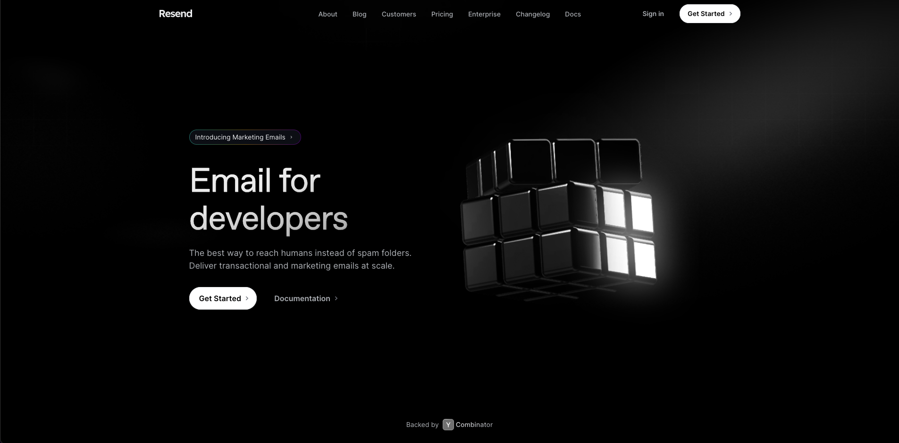

You can send transactional emails, start a marketing campaign, and create beautiful emails using React. And this all comes with a generous free tier.

You can also add your custom domain where the "from" field will be sent from your domain.

## Resend Domain Config and API Key

Sign up for Resend and verify your email. There are two steps we're going to complete here. You can skip the Custom Domain instructions if that doesn't apply to you.

### Add your Custom Domain

Once you're verified and logged into Resend, head over to the Domains page in the left panel. You should see a similar page to the one below.

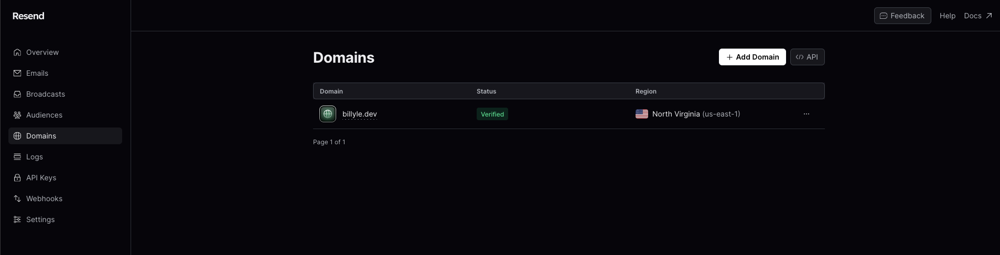

I already have mine set up but click on "+ Add Domain" and you'll enter your Custom domain and a region.

After that, you need to go to your DNS provider and enter all the DNS records that Resend provides you on the following page. I have Cloudflare as my DNS provider.

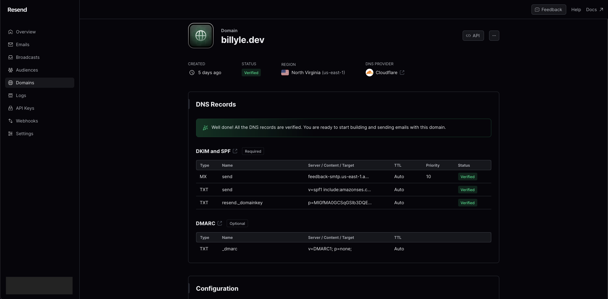

There will be a button for you to verify your DNS records. My recommendation is to wait for an hour and then try to verify that your DNS records are correctly configured with your provider.

You should see all green "Verified" badges next to all the records you need to add.

### Create a Resend API Key

Once that's done, head over to the API Keys page for Resend. Here I'm redacting my API Key for security purposes but I'll run you through setting up a new API Key with your custom domain.

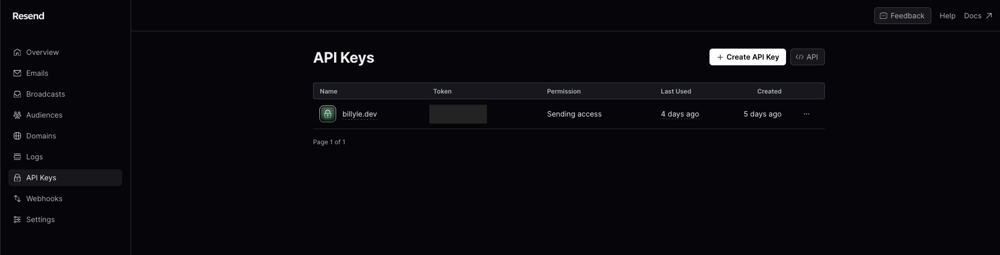

Click on "+ Create API Key" and a dialog will pop up.

1. Enter a name for your API key.
2. Select "Sending Access" under Permission since we're only using this for sending emails.
3. In the Domain dropdown, select your verified custom domain.
4. Finish by clicking "Add"

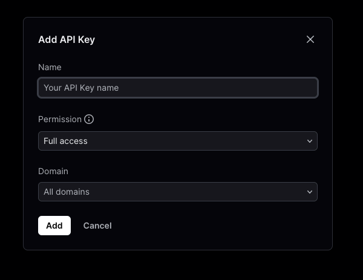

And that's all! Now onto the coding part.

## Setting up the Front-end

I'm using AstroJS and Tailwind for styling, but you can use vanilla or another framework if you like. Either works since we just need an HTML and some frontend JavaScript to make POST requests.

<br />

### Create a simple Form element

You'll need a basic contact form markup:

```astro
<form class="contact-form flex flex-col space-y-4 max-w-md">
  <input
    type="text"
    name="name"
    class="h-10 px-3 rounded ring-2 ring-neutral-300"
    placeholder="Name"
    required
  />
  <input
    type="email"
    name="email"
    class="h-10 px-3 rounded ring-2 ring-neutral-300"
    placeholder="Email"
    required
  />
  <textarea
    name="message"
    class="px-3 py-2 rounded ring-2 ring-neutral-300"
    rows={5}
    placeholder="What would you like to say?"
    required></textarea>
  <div class="flex justify-end space-x-2">
    <button
      type="submit"
      class="px-3 py-1 rounded text-xl text-slate-50 bg-slate-900 dark:bg-slate-700 dark:ring-2 dark:ring-slate-50"
    >
      Submit
    </button>
  </div>
</form>
```

### Basic Form Event Handler

In a script tag, we'll need to target the form and listen for events.

```astro
<script>
  const contactForm =
    contactsContainer.querySelector<HTMLFormElement>(".contact-form");

  if (contactForm) {
    contactForm.addEventListener("submit", async (e) => {
      e.preventDefault();

      const formEl = e.target as HTMLFormElement;
      const formData = new FormData(formEl);

      const requestBody = {
        name: formData.get("name"),
        email: formData.get("email"),
        message: formData.get("message"),
      };

      console.log(requestBody);
    });
  }
</script>
```

You might be using React or some other framework but the idea here is to prepare our front-end code to start sending requests.

### Test form submission

This is all we're going to need for the time being. Fire up your frontend server then fill out your contact form and hit submit. You should see a log in the dev console with your input.

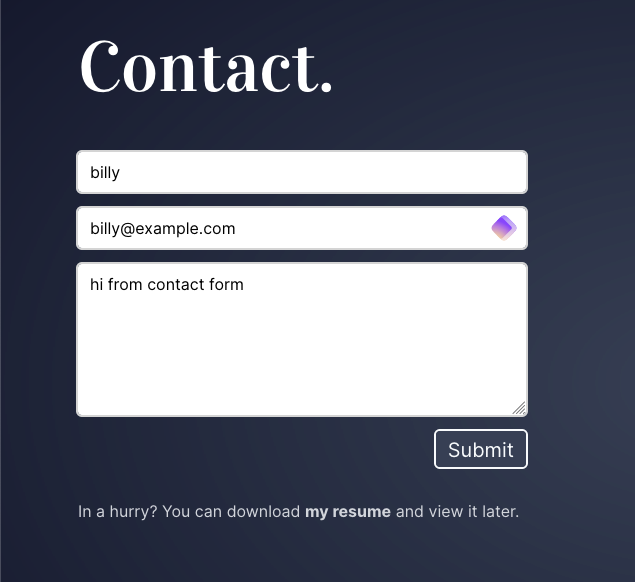

```javascript
{
  "name": "billy",
  "email": "billy@example.com",
  "message": "hi from contact form"
}
```

## Prepare the Back-end

I'm using Bun, which is a JavaScript run-time like Node. You should get very similar results if you're using Node and a web app framework like Express. If you need in that regard, feel free to reach out.

### Create a `.env` file

Create a `.env` file. Use the template below since it is what I'm using these properties that will be used by our server.

You'll need to install the [dot-env](https://www.npmjs.com/package/dot-env) package if you're using Node. The link will show you how to set it up.

Be sure to enter your Resend API key here.

```env
SERVER_PORT=3000
RESEND_API_KEY=<API Key from Resend>
EMAIL_TO=hi@billyle.dev
ALLOWED_ORIGIN=billyle.dev
```

### Install the Resend package

We also need to install the [resend](https://www.npmjs.com/package/resend) package. We'll instantiate a new Resend object and pass in our API key which will allow us to send our emails.

This is what a basic setup would look like:

```typescript
const resend = new Resend(Bun.env.RESEND_API_KEY);

const { error } = await resend.emails.send({
  from: `${name} <${Bun.env.EMAIL_TO}>`,
  to: [Bun.env.EMAIL_TO],
  subject: `New Message Received From ${name}`,
  react: EmailTemplate({ name, email, message }),
});
```

### Creating our Bun server

We'll be creating our server next.

If you're unfamiliar with Bun, there is a web app framework called [ElysiaJS](https://elysiajs.com/) which is similar to ExpressJS. It comes with some cool features like validation which I'm using below.

I've added some comments to explain a bit of what's going on.

```typescript
import { Elysia, t } from "elysia";
import { cors } from "@elysiajs/cors";
import { Resend } from "resend";
import { EmailTemplate } from "./email-templates/message";
import winston, { format } from "winston";

const { errors, printf, combine, colorize, timestamp } = format;

// logger for server logs
export const logger = winston.createLogger({
  level: "info",
});

logger.add(
  new winston.transports.Console({
    format: combine(
      errors({ stack: true }),
      colorize({ all: true }),
      timestamp(),
      printf(
        ({ level, message, timestamp, stack }) =>
          `[${timestamp}]:${level}: ${message}${stack ? `\n\n${stack}` : ""}`,
      ),
    ),
  }),
);

const resend = new Resend(Bun.env.RESEND_API_KEY);
const serverPort = Bun.env.SERVER_PORT || 3000;

// creating Elysia instance
new Elysia()
  .use(
    cors({
      methods: ["POST"],
      origin: [
        Bun.env.NODE_ENV === "production"
          ? Bun.env.ALLOWED_ORIGIN
          : "localhost:4321",
      ],
    }),
  )
  .post(
    "/send-email",
    async (context) => {
      const { name, email, message } = context.body;

      try {
        // the part where we are sending emails
        const { error } = await resend.emails.send({
          from: `${name} <${Bun.env.EMAIL_TO}>`,
          to: [Bun.env.EMAIL_TO],
          subject: `New Message Received From ${name}`,
          react: EmailTemplate({ name, email, message }),
        });

        // error sending email, send back error status and message
        if (error) {
          return context.error((error as any).statusCode, error);
        }

        logger.info("New email received");
        return new Response(JSON.stringify({ message: "Success" }), {
          headers: {
            "content-type": "application/json",
          },
        });
      } catch (error) {
        // catch error and log it, respond to user
        if (error instanceof Error) {
          logger.error(error.message, error);
        }
        return context.error("Internal Server Error", error);
      }
    },
    {
      // body must be of three properties: name, email, and message
      // validation happens as a middleware
      body: t.Object({
        name: t.String({
          minLength: 3,
          error: "Name must be at least 3 characters",
        }),
        email: t.String({
          format: "email",
          error: "Invalid email format",
        }),
        message: t.String({
          minLength: 1,
          maxLength: 1024,
          error:
            "Message should be at least 10 characters and max of 1024 characters",
        }),
      }),
      // any errors that happens during validation will be logged
      error: ({ path, body, request: { method, headers }, error, code }) => {
        const errorMessage = `method=${method} path=${path} error=${
          error.message
        } body=${JSON.stringify(body)} userAgent=${headers.get("user-agent")}`;
        logger.error(errorMessage);
        return error;
      },
    },
  )
  // if any errors happen on the server itself, log the errors
  .onError(({ path, request: { method, headers }, error }) => {
    const errorMessage = `method=${method} path=${path} userAgent=${headers.get(
      "user-agent",
    )}`;
    logger.error(errorMessage, error);
    return error;
  })
  .listen(serverPort, () => {
    logger.info(`Server starting on PORT: ${serverPort}`);
  });
```

<br />

In a nutshell, we created a server that is listening on Port 3000.

Whenever a POST request is received to `/send-email`, our middleware will validate the incoming body.

If any validation errors occur, we log it on our server and also return it as a response object.

Now, if everything seems okay, we're going to attempt to send an email to Resend which in turn, will forward the email in our `to:` field.

Pretty simple right?

## Front-end meets Back-end

Back on our front end, we're going to make a fetch request to our server listening on Port 3000. My AstroJS server is running on PORT 4321 so make sure you distinguish the two.

In the event listener on form submission, we'll update our code to use `fetch()` as a POST request to our email server.

Please not the comments in the following code.

```astro
<script>
  const contactForm =
    contactsContainer.querySelector<HTMLFormElement>(".contact-form");

  if (contactForm) {
    contactForm.addEventListener("submit", async (e) => {
      e.preventDefault();

      const formEl = e.target as HTMLFormElement;
      const formData = new FormData(formEl);

      const requestBody = {
        name: formData.get("name"),
        email: formData.get("email"),
        message: formData.get("message"),
      };

      try {
        const { message } = await fetch(
          import.meta.env.PROD
            ? "https://api.mycustomdomain.com/send-email" // host a production server with your custom domain
            : "http://localhost:3000/send-email",
          {
            method: "POST",
            body: JSON.stringify(requestBody),
            headers: {
              "Content-Type": "application/json",
            },
          },
        ).then((res) => res.json());

        // store input elements in a variable for later use
        const nameInput =
          formEl.querySelector<HTMLInputElement>('input[name="name"]');
        const emailInput = formEl.querySelector<HTMLInputElement>(
          'input[name="email"]',
        );
        const messageInput = formEl.querySelector<HTMLTextAreaElement>(
          'textarea[name="message"]',
        );

        // remove all error classes from the inputs
        nameInput?.classList?.remove("ring-red-500");
        emailInput?.classList?.remove("ring-red-500");
        messageInput?.classList?.remove("ring-red-500");

        // store adjacent siblings to see if they are error divs
        const errorName = nameInput?.nextElementSibling as HTMLDivElement;
        const errorEmail = emailInput?.nextElementSibling as HTMLDivElement;
        const messageError = messageInput?.nextElementSibling as HTMLDivElement;

        // each if statement checks the input adjacent sibling and removes them from the DOM
        // if they have the `data-error="true"` attribute
        if (errorName?.dataset?.["error"]) {
          errorName.remove();
        }
        if (errorEmail?.dataset?.["error"]) {
          errorEmail.remove();
        }
        if (messageError?.dataset?.["error"]) {
          messageError.remove();
        }

        // create the error div with the data-error="true" attribute
        function createErrorMessage(message: string) {
          const p = document.createElement("p");
          p.className = "text-sm text-red-400";
          p.dataset["error"] = "true";
          p.textContent = message;
          return p;
        }

        // insert the error divs after to the input element
        function insertErrorMessage(el: HTMLElement) {
          const error = el?.nextSibling as HTMLDivElement;
          if (!error?.dataset?.["error"]) {
            const div = createErrorMessage(message);
            el?.insertAdjacentElement("afterend", div);
          }
        }

        // create a toaster message upon success
        async function createSuccessToaster() {
          const div = document.createElement("div");
          const p = document.createElement("p");
          div.className =
            "fixed bottom-8 right-8 p-4 bg-slate-200 dark:bg-slate-700 shadoow-lg rounded-md opacity-0 transition-opacity duration-300 border-t-4 border-emerald-400 border-solid";
          p.className = "text-xl text-slate-800 dark:text-slate-100";
          p.textContent = "Your message has been sent!";
          div.appendChild(p);
          document.body.appendChild(div);

          // using sleep to animate the toaster
          await sleep(100);
          div.classList.remove("opacity-0");
          await sleep(3000);
          div.classList.add("opacity-0");
          await sleep(200);
          div.remove();
        }

        // message could be success or errors
        switch (message) {
          case "Success": {
            // reset the form on success and show a toaster
            formEl.reset();
            createSuccessToaster();
            break;
          }
          case "Name must be at least 3 characters": {
            if (nameInput) {
              insertErrorMessage(nameInput);
            }
            break;
          }
          case "Invalid email format": {
            if (emailInput) {
              insertErrorMessage(emailInput);
            }
            break;
          }
          case "Message should be at least 10 characters and max of 1024 characters": {
            if (messageInput) {
              insertErrorMessage(messageInput);
            }
            break;
          }
          default: {
            // if message is received, log it out in the dev console
            if (import.meta.env.DEV) {
              console.log("Unknown message: ", message);
            }
          }
        }
      } catch (err) {
        // if anything else happens during sending, log it out in the dev console
        if (import.meta.env.DEV) {
          console.log(err);
        }
      }
    });
  }
</script>
```

Alright, a lot going on here. Since I'm not using a front-end framework, I'm using vanilla JavaScript to manually manage the form state and show UI elements based on the server response.

And now if you try to submit a form, you should see it hitting your server and show up in the server logs.

Try submitting different values and see what kind of messages are generated.

## Deploying your Email Server

Now it's time to deploy the email server.

First, you're going to need a server. You can purchase a Virtual Private Server (VPS) or go through a managed service like Digital Ocean Droplets or Heroku.

With the former services, it should be fairly easy since you'll connect your GitHub account, point the server to your GitHub repository, and let it build/run for you. There are plenty of tutorials on this topic which I will not cover here.

I have a Hetzner VPS with Coolify installed so I'll be using this configuration. If you're interested in this setup, please check out two of my other blog posts where I show you how to [self-host with Coolify](/posts/self-hosting-your-website-with-coolify-v4-a-step-by-step-guide) and [add Github preview deployments to Coolify](posts/adding-github-pull-request-preview-deployments-with-coolify).

In the Coolify admin page, create a New Project as usual.

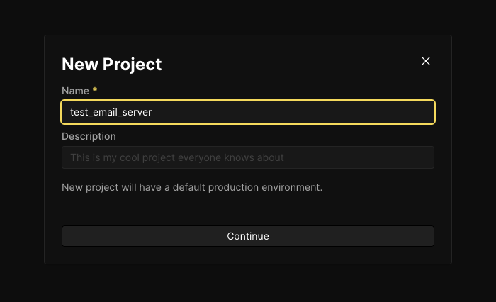

Then select the "Production" environment on the following page.

### Adding a Resource

This next step will depend if you have Coolify integrated with GitHub or not. With a GitHub integration, Coolify can automatically deploy a new build whenever you make changes to your main branch.

If you don't have this configured yet, don't fret. You can just copy the GitHub URL to the email server repository but you have to manually redeploy anytime you make a change to see an effect.

Go ahead and add a new Resource and you will see this next page.

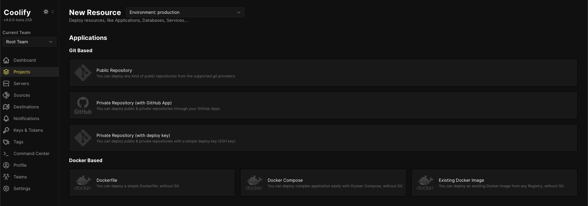

From there keep selecting the server you want to host it from, and then the destination.

### Configuring the app settings

When you get to the Configuration page, you would want to choose the `Nixpacks` build pack. It will automatically detect your stack and deploy a container for you.

Before we deploy, we want to add environment variables.

Navigate to the environment variables page and enter the environment variables we used in the `.env` file.

There should be 4 variables to create:

1. `SERVER_PORT`: the PORT you want to use
2. `RESEND_API_KEY`: the key from Resend
3. `EMAIL_TO`: the email address where you will receive the messages
4. `ALLOWED_ORIGIN`: the domain that is only allowed to make requests

If you're running a server different from the front-end server, you'll need to use the `ALLOWED_ORIGIN` and enter your front-end domain value. This will help with CORS and allow your server to accept requests from your custom domain.

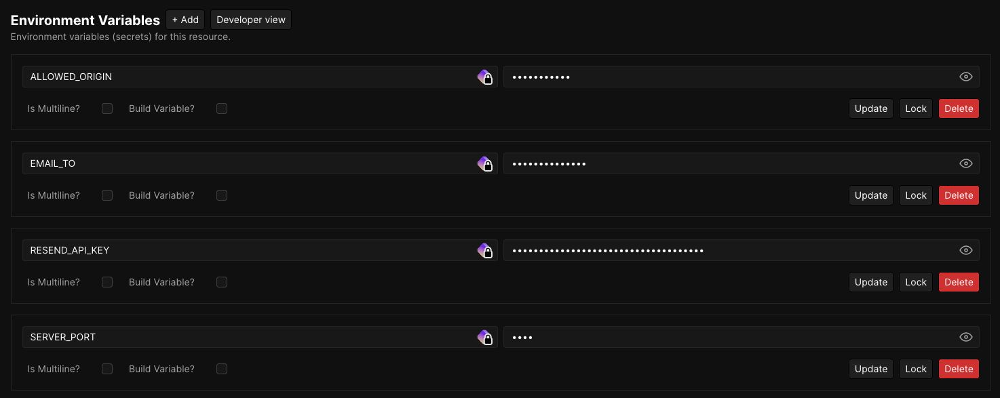

Then back on the main configuration page, we want to add a Start command to run after our build finishes.

Add `NODE_ENV=production bun run start`

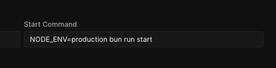

Then in the Domain field, add a custom domain name. I have Coolify set up to use subdomains so here I'm using `https://test-email.billyle.dev`.

So my front-end application will now make POST requests to `https://test-email.billyle.dev/send-email`.

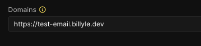

Click save and deploy your application.

If all is good, you should see a green status dot saying "Healthy".

## Test the integration

Update your front-end code where you're making the POST request.

```typescript
const { message } = await fetch(
  import.meta.env.PROD
    ? "https://test-email.billyle.dev/send-email" // change this part here
    : "http://localhost:3000/send-email",
  {
    method: "POST",
    body: JSON.stringify(requestBody),
    headers: {
      "Content-Type": "application/json",
    },
  },
).then((res) => res.json());
```

From the Contact Form, enter all the details and click Submit.

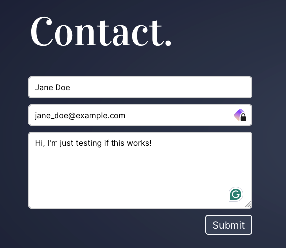

If it's successfully submitted, hopefully, you have a way of displaying to your users that it was successful. Here is my toast message that shows that.

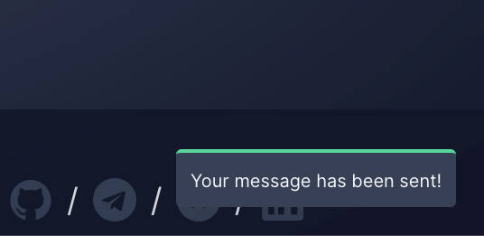

From your Resend dashboard, you can all the emails that flowed through by checking the "Emails" page.

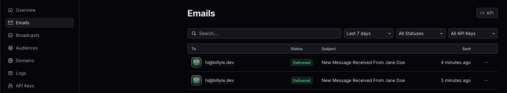

I can see the "Jane Doe" email I sent earlier which is a good thing.

And then in your inbox, you should see your test email as below.

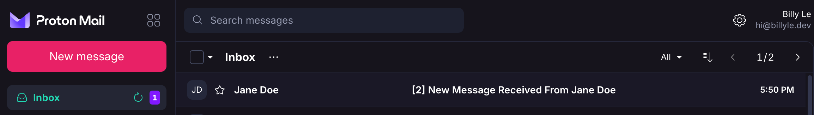

Congratulations! It's all working! Now you can deploy your front-end and do the same testing to see if it works in production.

## Conclusion

That was quite a long post but I hope it gave you some ideas on how you too could implement an email server using Resend and deploying it somewhere live.

The Resend documentation is well-written as they have nearly every language support. You can easily copy and paste the code and test it from there.

If you need help with any of this setup, please use my [Contact Form](/#contact)!

There are some things I didn't include like fighting spam using honeypot techniques but that's above my current knowledge.

Well, until then, thank you for reading, and have a good one.
