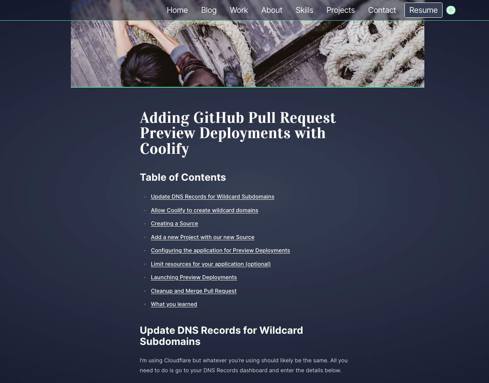
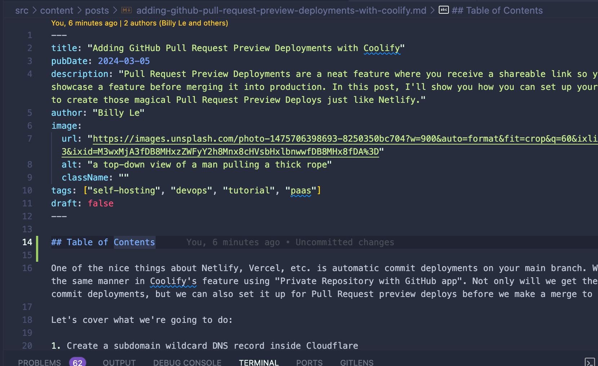

Having a Table of Contents (ToC) for your blog is nice because it allows users to see an overview of your content and provides a quick way to navigate between sections. To do this in Astro with the Content Collections API, there's a bit of legwork, but the results are satisfying. But first, let's talk about the issues I ran into.

## The problem

I tried to do this with the plugin, **'remark-toc'**, which is mentioned in the Astro documentation. What I didn't like about it is that if I wanted to include a ToC, I would have to manually add it to the top of all my `.md` files.



Another note is that wherever I included it in the markdown, the ToC sits statically and to style it, I would have to target the `id` and fight my existing blog layout.



This is not ideal for me. I had to figure out a better way to do this.

## Retrieving all headers of a markdown

In the official documentation, there are [two ways you can get all the headings](https://docs.astro.build/en/guides/markdown-content/#exported-properties) of your blog posts. The two ways are when you're importing a `.md` into a `.astro` file or using the `Astro.glob()` function. Neither of those was valid in my case because I'm using the Content Collections API.

Buried in the documentation, I found that you can get the [headings from a RenderedEntry](https://docs.astro.build/en/reference/api-reference/#collection-entry-type) if you're using the Content Collections API.

Inside of my `/src/pages/posts/[...slug].astro` where I am pre-rendering my blog posts using `getStaticPaths()`, I have a utility function that pulls all my published blog posts into a collection. From there, I extract the headings using a `Promise.all()`.

```typescript
---
import BlogLayout from "../../layouts/BlogLayout.astro";
import { allPosts } from "@utils/getCollection";
import type { GetStaticPaths } from "astro";

export const getStaticPaths = (async () => {
  const headings = await Promise.all(
    allPosts.map((entry) => entry.render().then((data) => data.headings)),
  );

  const posts = allPosts.map((entry, index) => {
    return {
      params: { slug: entry.slug },
      props: { entry, headings: headings[index] },
    };
  });

  return posts;
}) satisfies GetStaticPaths;

const { entry, headings } = Astro.props;
const { Content } = await entry.render();
---

<BlogLayout {...entry.data} {headings}>
  <Content />
</BlogLayout>
```

For reference, inside an Astro Collection, you have a list of Entries. These Entries have a `render()` method that compiles the `.md` file for rendering. It also returns a property called `headings` which I used here to collect all the headings in a given markdown.

Here is the shape of that:

```typescript
// headings shape
const headings: {
  depth: number;
  text: string;
  slug: string;
}[];
```

With that, I returned it inside the props object which can be extracted from `Astro.props`.

## Creating the heading hierarchy

I have all the headings passed down to my `BlogLayout` component, and now I can use it. The first thing I need to do is make sure that there is a hierarchy of headings so that the ToC properly indents the headings.

I tried doing this on my own with a recursive function but didn't have too much success. Luckily, I came across this [blog by Reza Zahedi](https://rezahedi.dev/blog/create-table-of-contents-in-astro-and-sectionize-the-markdown-content#retrieving-the-headings-prop-in-astro-layouts-or-components) that showed me a good foundation to start with.

With the ~~stolen~~ copied code, I noticed that the nesting only allowed one list of subheadings. So if a heading has a depth of 2, and two headings succeeding that is of depth of 3 and 4 respectively, then it outputs something like this:

```typescript
const nestedHeadings = [
  {
    depth: 2,
    text: "My Heading",
    slug: "my-heading",
    subheadings: [
      {
        depth: 3,
        text: "My Subheading 1",
        slug: "my-subheading-1",
      },
      {
        depth: 4,
        text: "My Subheading 2",
        slug: "my-subheading-2",
      },
    ],
  },
];
```

I was okay with this since I do not want the ToC to get carried away with indentations. I wanted to prevent from writing any headings greater than 3, so I added a guard to throw an error if I did include one by accident.

Inside my `TOCHeading.astro` component, I'm exporting an interface:

```typescript
import type { MarkdownHeading } from "astro";
export interface HeadingHierarchy extends MarkdownHeading {
  subheadings: HeadingHierarchy[];
}
```

Inside my `BlogLayout.astro` component:

```typescript
import type { HeadingHierarchy } from "@ui/components/TOCHeading.astro";
import type { MarkdownHeading } from "astro";

const { headings } = Astro.props;

function createHeadingHierarchy(headings: MarkdownHeading[]) {
  const topLevelHeadings: HeadingHierarchy[] = [];

  headings.forEach((heading) => {
    if (heading.depth > 3) {
      throw Error(
        `Depths greater than 3 not allowed:\n${JSON.stringify(heading, null, 2)}`,
      );
    }
    const h = {
      ...heading,
      subheadings: [],
    };

    if (h.depth === 2) {
      topLevelHeadings.push(h);
    } else {
      let parent = topLevelHeadings[topLevelHeadings.length - 1];
      if (parent) {
        parent.subheadings.push(h);
      }
    }
  });

  return topLevelHeadings;
}

const toc: HeadingHierarchy[] = createHeadingHierarchy(headings ?? []);
const hasToC = toc.length > 1;
```

I'm using a variable called `hasToC` since in some cases I have a short blog post with only one heading, and it doesn't make sense to show the ToC. I use this variable to conditionally render the ToC and the appropriate layout.

## Rendering the ToC

Rendering is fairly straightforward in Astro. I have a `TOCHeading.astro` component that I found in the other blog post and made minor adjustments like giving it types and such.

If you're going to use a sticky ToC, be sure that the parent component has a `position: relative` and that there is no `overflow` property on it. If your parent is a `flex` or `grid` parent, you need to wrap your `position: sticky` ToC with a container so that it will properly work.

```jsx
<section class={`${hasToC ? "mx-auto max-w-7xl lg:grid lg:grid-cols-4" : ""}`}>
  {hasToC && (
    <div class="prose relative mx-auto px-4 dark:prose-invert xl:pt-10 2xl:px-0">
      <nav class="xl:sticky xl:top-20">
        <h2 class="text-emerald-400">Table of Contents</h2>
        <ul>
          {toc.map((heading) => (
            <TOCHeading heading={heading} />
          ))}
        </ul>
      </nav>
    </div>
  )}

  <article
    class={`prose mx-auto px-4 py-10 dark:prose-invert sm:prose-lg lg:prose-xl
            prose-h1:font-vidaloka prose-code:before:hidden
            prose-code:after:hidden sm:py-20
            ${hasToC ? "lg:col-span-3" : ""}
        `}
  >
    <h1>{title}</h1>
    <slot />
  </article>
</section>
```

## The results

As you can see, my Table of Contents appears on the left-hand side. Now you can easily move between sections as you read!

For now, I'm only supporting the sticky ToC for desktops as I haven't found a good UI for tablets and mobile devices yet.

I guess all that's left to do is highlight the ToC heading that is currently being viewed, but I'll do that some other time.

I hope that was a bit helpful if you're trying to add a ToC for your Astro website if you're using the Content Collections API.

Well, thanks for reading and I hope you have a good one.
