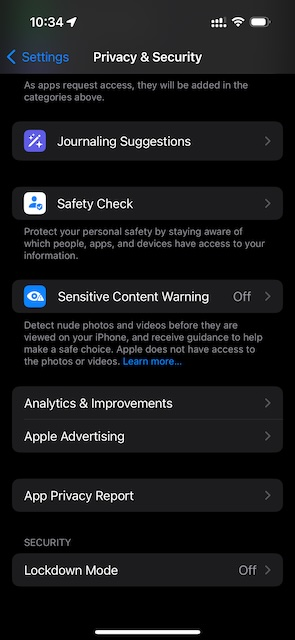

I had trouble recently trying to find the "Developer Mode" settings on my iPhone. I tried viewing the "Privacy & Security" settings and scrolling down to the bottom only to find that it wasn't there.

Even the official documentation was not helpful and users around the internet repeated the same instructions.

It wasn't until I found an obscure comment that helped me unlock "Developer Mode". So now I'm going to share how I got "Developer Mode" to show.

## How to enable "Developer Mode" for iPhone and Xcode

1. [Download Xcode](https://developer.apple.com/xcode/) on your macOS device.
   

2. Connect your iPhone to your macOS device and make sure to trust your device on your iPhone.
   

3. And enter your passcode on your iPhone
   

4. Open Xcode and navigate to the settings "Product" > "Destination" > "Manage Run Destinations"
   

5. You should see your device now but there's a warning banner that "Developer Mode" is not enabled.
   

6. Head over to "Privacy & Security" in "Settings" on your iPhone and you should now see "Developer Mode".
   

7. Turn it on and it will ask you to "Restart" which is required.
   

8. Upon logging back into your iPhone, it will confirm you want to turn on "Developer Mode". Press "Turn On".
   

9. One last time you'll be asked to enter your passcode.
   

10. If you look at Xcode, you should see that your iPhone will try to pair. If not, you may need to wait or click on the warning banner.
    

That's it!

You now have "Developer Mode" set on your iPhone. Turn off "Developer Mode" by going back to your iPhone "Privacy & Security" settings if you no longer need it.

Good luck, happy coding and see you next time.
