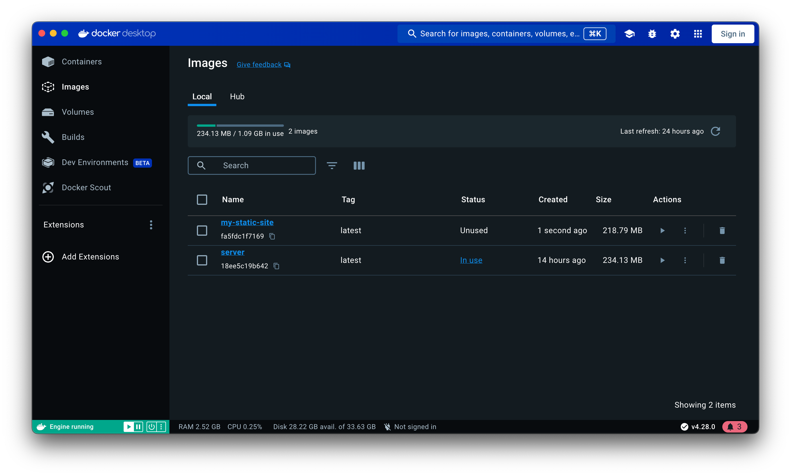
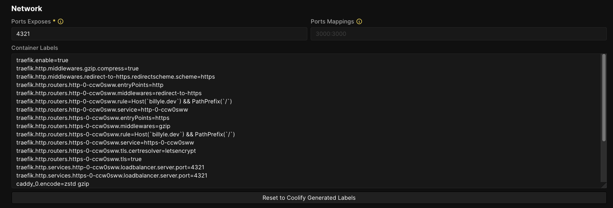

When I first started using Coolify, I came across a bug where my 404 page was not being served.

In development, it was all smooth sailing. But in production, going to a non-existent URL would always redirect back to the home page.

This was a bit frustrating since I didn't know where to start to begin debugging.

As of Coolify v4.0.0-beta.258, I suspect it was how Nixpacks did not correctly configure the server.

But luckily, I was able to come up with a solution and am here to share that with you if you're in this situation.

## The solution

Instead of having Nixpacks magically take care of everything, we need to have two things to replace the build pipeline.

That is:

1. containerizing our site
2. creating a reverse proxy

The two technologies I chose are Docker and Nginx for this fix.

## Install Docker Desktop

[Download and install Docker Desktop](https://www.docker.com/products/docker-desktop/), which will contain a graphical user interface for Docker. It comes with all the bells and whistles like the CLI, the background daemon, and Docker Compose.

## Using Docker Init

To get started, you can use the command `docker init` which will run an interactive terminal where it can detect what you're using for your project.

This is what you'll see when the command is entered into the terminal:

```
Welcome to the Docker Init CLI!

This utility will walk you through creating the following files with sensible defaults for your project:
  - .dockerignore
  - Dockerfile
  - compose.yaml
  - README.Docker.md

Let's get started!

? What application platform does your project use?  [Use arrows to move, type to filter]
> Node - (detected) suitable for a Node server application
  Go - suitable for a Go server application
  Python - suitable for a Python server application
  Rust - suitable for a Rust server application
  ASP.NET Core - suitable for an ASP.NET Core application
  PHP with Apache - suitable for a PHP web application
  Java - suitable for a Java application that uses Maven and packages as an uber jar
  Other - general purpose starting point for containerizing your application
  Don't see something you need? Let us know!
  Quit
```

Follow the prompts and it will generate a template for you.

## Modifying the Dockerfile

If you look at the Dockerfile, it has some sensible stages like building the dependencies and building the app.

I'm removing most of the generated comments so it's easier to follow.

```docker
# syntax=docker/dockerfile:1

ARG NODE_VERSION=21.4.0
ARG PNPM_VERSION=8.12.0

FROM node:${NODE_VERSION}-alpine as base

WORKDIR /usr/src/app

RUN --mount=type=cache,target=/root/.npm \
    npm install -g pnpm@${PNPM_VERSION}

FROM base as deps

RUN --mount=type=bind,source=package.json,target=package.json \
    --mount=type=bind,source=pnpm-lock.yaml,target=pnpm-lock.yaml \
    --mount=type=cache,target=/root/.local/share/pnpm/store \
    pnpm install --prod --frozen-lockfile

FROM deps as build

RUN --mount=type=bind,source=package.json,target=package.json \
    --mount=type=bind,source=pnpm-lock.yaml,target=pnpm-lock.yaml \
    --mount=type=cache,target=/root/.local/share/pnpm/store \
    pnpm install --frozen-lockfile

COPY . .
RUN pnpm run build

################################################################################
# Create a new stage to run the application with minimal runtime dependencies
# where the necessary files are copied from the build stage.
FROM nginx:stable-alpine3.17 as final
COPY nginx.conf /etc/nginx/nginx.conf
COPY --from=build /usr/src/app/dist /usr/share/nginx/html
EXPOSE 4321
```

<br />

The final stage is what I had modified for my project.

```docker
FROM nginx:stable-alpine3.17 as final
COPY nginx.conf /etc/nginx/nginx.conf
COPY --from=build /usr/src/app/dist /usr/share/nginx/html
EXPOSE 4321
```

I am pulling the latest Nginx image from DockerHub with the 'alpine' tag.

Then I'm copying over my `nginx.conf` file, which we'll create later, into the Nginx directory where it will be used as configuration.

Finally, from my build stage, I'm copying over my static files into the `/usr/share/nginx/html` directory.

Nginx will serve our static files from this default directory.

And finally exposing Port 4321, because that's what the local AstroJS development server is running on.

## Create the nginx.conf file

At the root of your directory, create a `nginx.conf` file.

The contents of this file will be something similar below for a static site.

```nginx
worker_processes  1;

events {
  worker_connections  1024;
}

http {
  server {
    listen 4321;
    server_name   _;

    root   /usr/share/nginx/html;
    index  index.html index.htm;
    include /etc/nginx/mime.types;

    gzip on;
    gzip_min_length 1000;
    gzip_proxied expired no-cache no-store private auth;
    gzip_types text/plain text/css application/json application/javascript application/x-javascript text/xml application/xml application/xml+rss text/javascript;

    error_page 404 /404.html;
    location = /404.html {
            root /usr/share/nginx/html;
            internal;
    }

    location / {
            try_files $uri $uri/index.html =404;
    }
  }
}
```

I won't explain all the details of the file but I want to note four parts.

Our `listen 4321;` matches what we exposed in the Dockerfile.

<br />

```nginx
error_page 404 /404.html;
```

This line is going to serve my custom 404 page built by AstroJS.

<br />

```nginx
location = /404.html {
          root /usr/share/nginx/html;
          internal;
}
```

The location of this 404 page is found in `/usr/share/nginx/html`

<br />

```nginx
location / {
          try_files $uri $uri/index.html =404;
}
```

Finally, at the root path, we'll use a special `$uri` variable for a lookup for that specific URL that was entered. The `try_files` will continue to look for the file and if it's not found, we'll respond with a 404.

## Testing locally with Docker

Everything is put in place, now it's time to test if this is going to work when we build an image with Docker.

Make sure that Docker Desktop is opened and in a terminal run the command:

`docker build -t my-static-site .`

Wait for the build to complete and if all goes well, you should see your built image with the tag name `my-static-site` in Docker Desktop.



Or if you're a terminal type of person, `docker images -a`

```
REPOSITORY       TAG       IMAGE ID       CREATED         SIZE
my-static-site   latest    fa5fdc1f7169   2 minutes ago   219MB
server           latest    18ee5c19b642   14 hours ago    234MB
```

Now we're going to launch and start up a container by running the command:

`docker run -p 4321:4321 my-static-site`

The docker container should be running in your terminal now:

```
/docker-entrypoint.sh: /docker-entrypoint.d/ is not empty, will attempt to perform configuration
/docker-entrypoint.sh: Looking for shell scripts in /docker-entrypoint.d/
/docker-entrypoint.sh: Launching /docker-entrypoint.d/10-listen-on-ipv6-by-default.sh
10-listen-on-ipv6-by-default.sh: info: Getting the checksum of /etc/nginx/conf.d/default.conf
10-listen-on-ipv6-by-default.sh: info: Enabled listen on IPv6 in /etc/nginx/conf.d/default.conf
/docker-entrypoint.sh: Launching /docker-entrypoint.d/20-envsubst-on-templates.sh
/docker-entrypoint.sh: Launching /docker-entrypoint.d/30-tune-worker-processes.sh
/docker-entrypoint.sh: Configuration complete; ready for start up
```

In a browser window, go to `localhost:4321` and you should see your website. If not, then your nginx might be misconfigured or you are missing something in the Dockerfile.

If your page loads, try going to a non-existent URL like `localhost:4321/this-is-not-a-real-page` and you should be greeted with your custom 404 page!

If it's a generic Nginx 404 page, you will have to fix that in your `nginx.conf` file.

Commit your files to Git and then push them to a remote repository like GitHub.

## Deploying on Coolify

All we need to do now is deploy on Coolify.

I'm assuming you already have a project running on Coolify because you are here.

On the Configuration page, under "Build Pack", select "Dockerfile".

Then make sure the "Dockerfile Location" is set to `/Dockerfile`


Under the "Network" configuration, enter `4321` for "Ports Exposes" and click on "Save".

When you hit save, make sure to look at the Traefik configuration is also pointing to PORT 4321.



When that's done, click "Redeploy" and Coolify will start building from the Dockerfile we've created.

If it succeeds, you can go to your live site and start testing.

## Conclusion

Hopefully, that fixes your issue! If all this is a little intimidating to you, don't worry, I've been there and you can reach out and get some help.

Now we know that all we need to do to fix the missing 404-page configuration is to write up our own Dockerfile and an Nginx config.

Well, that's all for now. Thanks for reading and have a good one!
