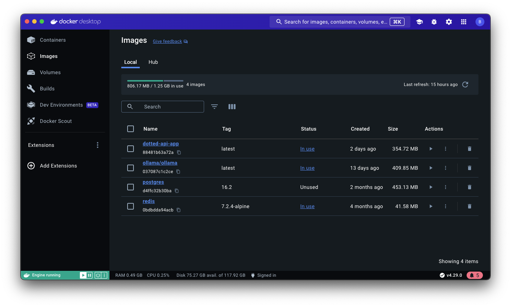
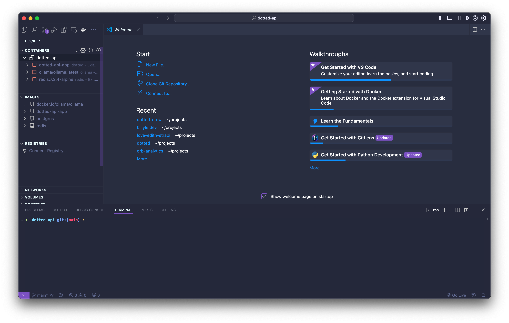

Have you ever come across a tool and were so impressed by it that you tried to integrate it into your daily workflow? First was TailwindCSS and now I can say that about Docker.

As a frontend developer first, I haven't considered learning Docker at all since there wasn't a reason for me to do so.

That is until I launched my self-hosted Coolify which uses Docker itself to deploy my applications.

Ever since then, I've been practicing and learning Docker on all my new projects.

And I wished I started sooner.

Understanding how to use Docker benefits me greatly as it is being used everywhere. Especially in the cloud.

## What is Docker 🐳?

From what I understand, [Docker](https://www.docker.com) offers containerization products that allow you to package your application as images with all its dependencies and run them as containers.

Each container is an instance of that image and you can run nearly infinite amounts if you had the resources.

That's why companies choose to build their infrastructure with containers; they scale well and meet the demands of their business.

Docker has many different products from CLI tools to desktop applications that help manage your images and containers.

There is also a Docker Hub, a cloud repository for images that can be hosted publicly or privately and where you can find official images.

## How do I use Docker?

There are several ways I'm using Docker at the moment. These include:

1. Using [Docker Desktop](https://www.docker.com/products/docker-desktop/)
2. Interacting with the [Docker Client CLI](https://docs.docker.com/reference/cli/docker/)
3. Docker as a Version Manager

Of these three listed, I primarily use #2. Usually, I run `docker compose` commands to build and run my images in one go.

I'll briefly describe how I use them below.

### Docker Desktop - a must

Docker Desktop is super neat. It does all the Docker things in one single beautiful UI.

And it's easy to get around and inspect every aspect of it too.

With Docker Desktop, you can view your images, containers, and volumes. You can also pull in new images or push your own to Docker Hub.



Once you have your containers running, you can inspect the container's contents, the logs, and some analytics like CPU and RAM usage.

You can launch VS Code from here by accessing the dropdown menu of a container.

I like using Docker Desktop to monitor all my images, containers, volumes, and build history. I also use it to pull one-off images to play with by using the search tools.

You can easily access this by <kbd>⌘K</kbd> if you're coming from a MacOS device.


In VS Code, I can download the [Docker extension](https://code.visualstudio.com/docs/containers/overview) that features running docker commands by the right-click menu and inspect container files.

This is super helpful when you're troubleshooting why the Docker build is missing some dependencies.

There's **so much** you can do and I have yet to touch Docker Scout, Docker Swarm, and extensions.

### Dockering through Docker CLI

I like using the CLI since I don't have to leave VS Code to interact with my containers.

Normally, I run `docker compose up --watch` and `docker compose down`.

The `--watch` flag watches for any changes you've specified in the `docker-compose.yaml` file.

```docker
services:
  app:
      container_name: my_app
      build: .
      develop:
        watch:
          - path: .
            action: sync
            target: /app
            ignore:
              - node_modules/
          - path: package.json
            action: rebuild
```

This configuration will watch any changes in my project using the watch fields.

There are three actions, `sync`, `rebuild`, and `restart`.

I'm using `sync` to sync any changes done on the host machine, to also reflect in the container. This makes a seamless experience like you're developing locally.

And if I ever need to install new dependencies, the action `rebuild` watches the `package.json` file, rebuilds the image, and launches new containers.

Learning the CLI commands to start, stop, list, and remove images and containers is pretty helpful too.

When I start using the CLI more frequently, I find myself not having to access the documentation as much anymore.

Like if I want to run a container with an exposed port, I know that's `-p`.

If there are environment variables that I want to use, that would be `-e`.

Once I got the hang of it all, I was spinning up and down containers fairly easily.

### My new version manager

I use Docker as a way to manage different versions of technologies like PostgreSQL, Redis, etc.

The reason for this is that I don't have to worry about anything breaking if I'm working on an old project.

For example, there were some breaking changes with Node when I was using the latest version and working on an old project.

I would try to run the server and it would spit out some cryptic error.

A few minutes later, I realized that the project was using an earlier version of Node. 😓

So I would switch to the correct version of Node to get it working.

While I can add some assistance for Node by updating the `package.json` with an `engines` field, it doesn't entirely solve the issue.

I had to **manually** switch my Node version and some time was wasted. I don't like that.

This is why having Docker as a version manager is advantageous. All I needed to do was build the image and run a container. That's all!

I haven't been using Docker for long so I don't know what all the pros and cons are but I think one downside of this approach is that you're using up more disk space by doing it this way.

## Using Docker in Development

I initially started using `docker init`. It's a command that quickly initializes your project with some Docker files.

However, after a while, I stopped using it since I didn't quite fully understand the generated output.

That's why I find myself writing the `Dockerfile` or `docker-compose.yaml` by hand because it gives me a lot of practice and get a grasp of how Docker works.

I make sure my `Dockerfile` can correctly build an image before I start working inside the compose file.

Here is a simple Dockerfile which uses Node:

```docker
# Run as a non-privileged user
FROM node:18-alpine
RUN useradd -ms /bin/sh -u 1001 app
USER app

# Install dependencies
WORKDIR /app
COPY package.json package.lock .
RUN npm install

# Copy source files into application directory
COPY --chown=app:app . /app

CMD ["node", "server.js"]
```

In the `docker-compose.yaml` I list out all my apps and services in my project.

So if I'm on Redis v6 and PostgreSQL v14, I can list those out and add a volume to each.

Then in my main service app, I add a watch field, which syncs the changes between the host and the container environment.

This is how it would look like:

```yaml
services:
  redis:
    image: redis:6-alpine
    port:
      - 6379:6379
    volumes:
      - node_app:/data

  db:
    image: postgres:14-alpine
    environment:
      - POSTGRES_USER=${POSTGRES_USER}
      - POSTGRES_PASSWORD=${POSTGRES_PASSWORD}
      - POSTGRES_DB=${POSTGRES_DB}
    port:
      - 5432:5432
    volumes:
      - node_app:/var/lib/postgresql/data

  app:
    container_name: node_app
    build:
      context: .
    environment:
      - POSTGRES_URL=postgres://${POSTGRES_USER}:${POSTGRES_PASSWORD}@db:5432/${POSTGRES_DB}
      - REDIS_URL=redis:6379
    develop:
      watch:
        - action: sync
          path: .
          target: /app
          ignore:
            - node_modules/
    ports:
      - 8000:8000
volumes:
  node_app:
    external: false
```

From here, I would run the `docker compose --watch` command and start coding on my app.

The different containers will all be on one network, all talking to each other by the service name reference.

All the data is stored in a separate volume which I can easily dispose of once I'm finished.

That's how easy it is once you've grown accustomed to working with Docker.

If you want to start learning now, you can view the [Develop with Docker](https://docs.docker.com/develop/) documentation which covers some basic information.

But to get further ahead, you have to play around with it to get the hang of it like I did.

## My plans ahead

> Smooth seas do not make skillful sailors - African Proverb

Even though Docker made it easy to build images and run containers, in no way did that make me a master.

I am still learning and dialing down my workflow.

To improve my skills, I plan to dive deeper when I start deploying to the cloud, working with a container orchestrator, and more.

Only then could I call myself an expert.

So far it's been a pleasing experience working with Docker and all their products.

I hope reading this convinces you to work with Docker if you have yet to do so.

I promise you'll gain so much from it.

Well, that's all I've got! Thank you for reading. As always, have a good one!
