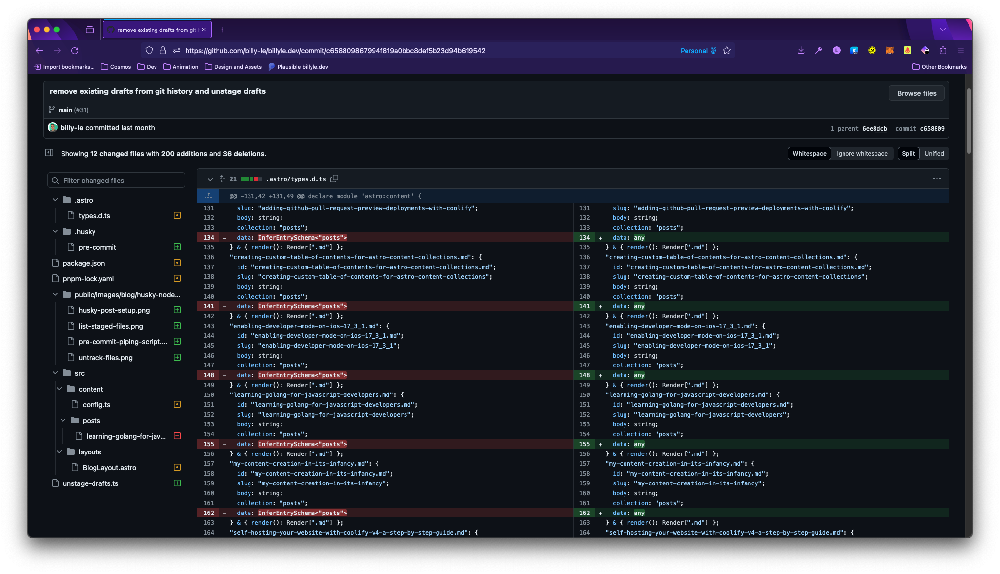

I'm not sure when but sometimes the type definitions in the .astro folder keep going out of sync once in a while. Instead of adding the schema definitions from my collections, it replaces them with the `any` type.

Here is a preview of the issue from my Git history:



This is an issue for me since I love working with Typescript and having that safety matters when I'm developing my site.

According to [Astro's docs](https://docs.astro.build/en/guides/content-collections/#the-astro-directory), it runs `astro sync` whenever you run `astro dev` or `astro build` so somehow during development, the types become `any`.

## The fix

We're going to re-sync our types and make sure that we get the results we want by running the `astro sync` command again on a Git commit.

Add a script to your `package.json` called `sync` or whatever you like and give it the value `astro sync`.

```json
{
  "scripts": {
    "sync": "astro sync"
  }
}
```

You'll need to have Husky installed in your project for this to work. It's relatively simple to set up and I talked about it [here](/posts/use-husky-and-node-to-unstage-draft-posts-from-git#what-is-husky).

Inside your `.husky/pre-commit` file, add these lines anywhere in the file. I'm using pnpm. Remember to replace "pnpm" with your package manager CLI command to run scripts.

```bash
pnpm sync
git add .astro/types.d.ts
```

And that should do it! Whenever you make a new commit, the pre-commit will fire and it will sync your content collections' schemas perfectly.

Thanks for reading and have a good one! 😄
