Did you lose access to your Hetzner VPS? I lost my access because I picked up a new laptop but wiped my old one that had access.

My server SSH configurations are as follows:

- Allow root access by SSH only with `PermitRootLogin without-password`
  - If you're using Coolify, you should leave it as `without-password`
- Clear text passwords are turned off via `PasswordAuthentication no`
- My user has admin permissions via `sudo`
- My user has an SSH key authorized for login via `ssh <user>@<vps_ip_address>`

From my new laptop, this wasn't going to allow me access to my VPS at all.

Luckily, I was able to work around it by accessing my root user through the Hetzner Cloud Console, and then rolling back the configurations to allow my user to log in with a password.

After that, with my new SSH key generated on my local machine, I used `ssh-copy-id <user>@<vps_ip_address>` to copy my local SSH key over to the VPS.

And not to forget, I reconfigured my server to the settings listed above for improved security.

Let's get started on how you can go about this.

## Access Hetzner console

Log in to your Hetzner account and navigate to the [Cloud Console](https://console.hetzner.cloud/projects).

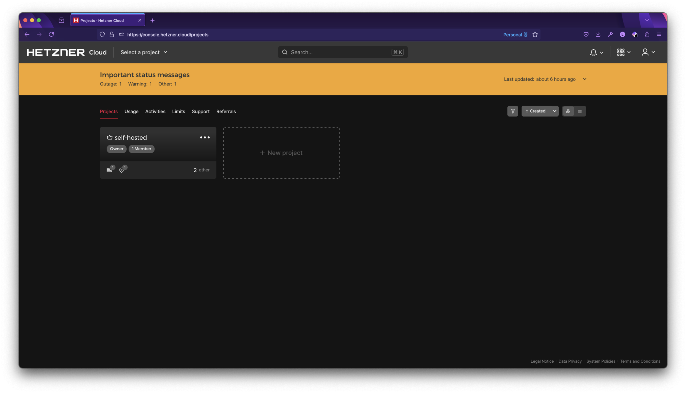

Choose the server you're trying to regain access to.

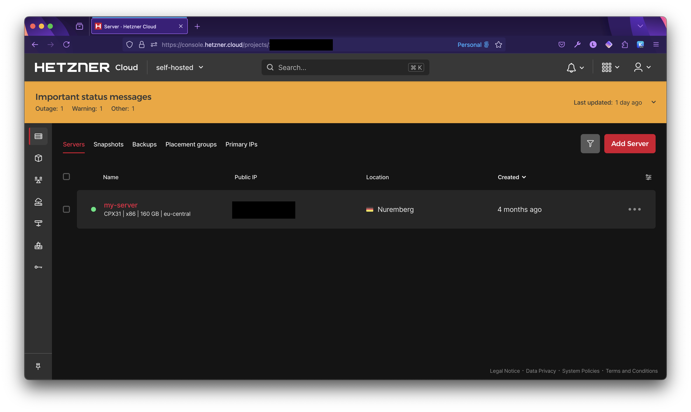

Click on the Console icon in the top right.

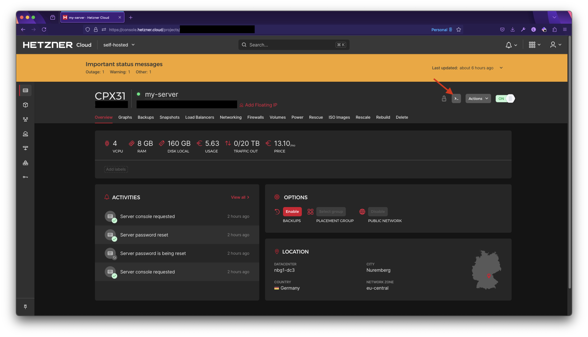

A new window should pop up. If you have pop-ups disabled, ensure you enable them for this website.

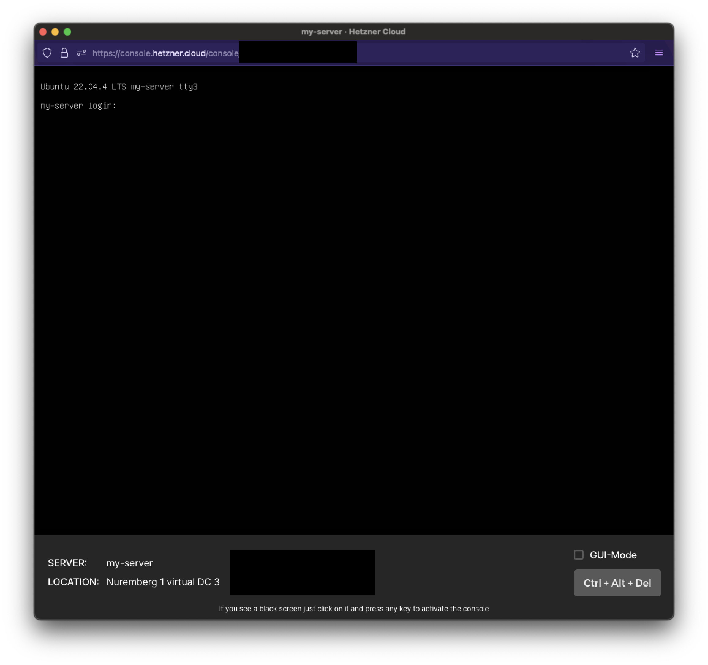

For the login, type in `root`, followed by your password.

> Note: Since this is a windowed console through the browser, you can't copy/paste text, so you will need to manually enter passwords for the time being until access is restored

If you forgot your `root` password, you can reset it in the previous page by going to the `Rescue` tab and click on `Reset Root Password`

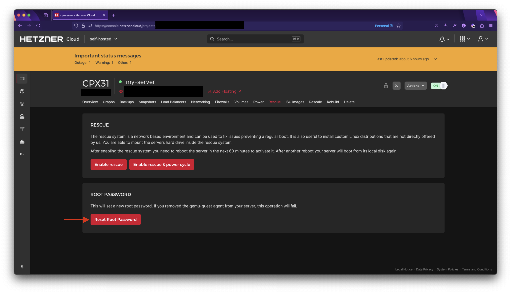

## Restore PasswordAuthentication

Once you have access to your VPS as root, you should be able to see your welcome message.

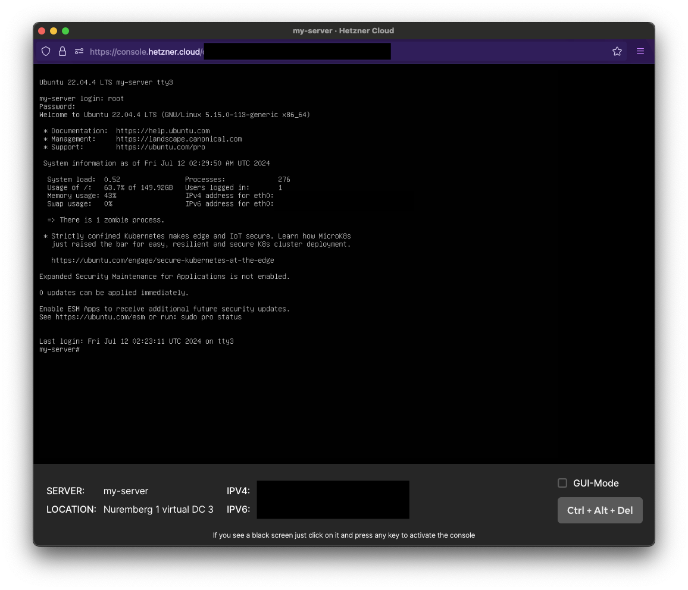

Once you're in, we're going to temporarily allow passwords for the SSH server.

To do that, we're going to modify the `/etc/ssh/sshd_config` file which configures the SSH server.

In the terminal, enter:

```bash
nano /etc/ssh/sshd_config
```

You'll see many options as a key / value pair. We want to go down to the line where `PasswordAuthentication` is and set that to `yes`

```bash
# For this to work you will also need host keys in /etc/ssh/ssh_known_hosts
#HostbasedAuthentication no
# Change to yes if you don't trust ~/.ssh/known_hosts for
# HostbasedAuthentication
#IgnoreUserKnownHosts no
# Don't read the user's ~/.rhosts and ~/.shosts files
#IgnoreRhosts yes

# To disable tunneled clear text passwords, change to no here!
PasswordAuthentication yes
#PermitEmptyPasswords no
```

Save the document by using <kbd>CTRL</kbd> + <kbd>X</kbd>. You'll be asked to save the modified buffer. Enter 'Y' for yes.

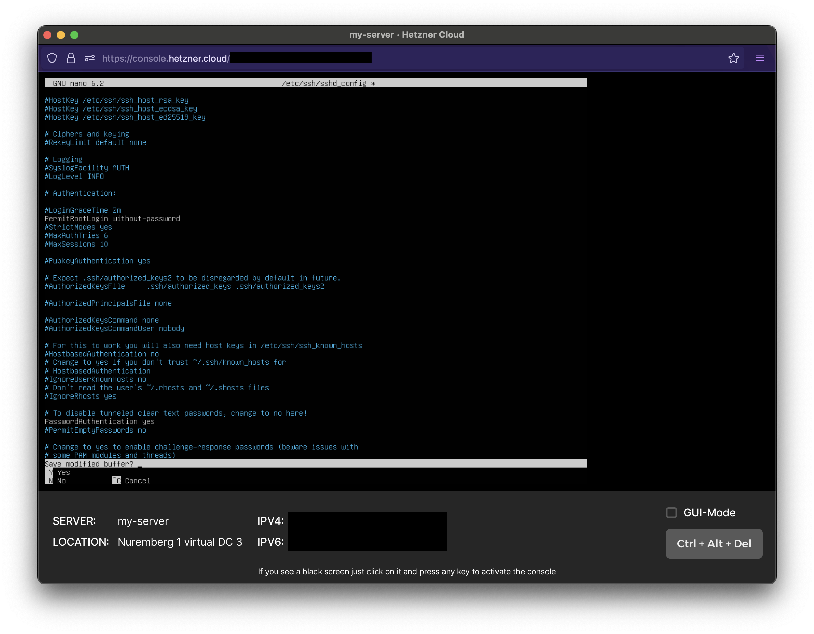

Then it will ask you where you want to save it. We will overwrite the file so hit enter again.

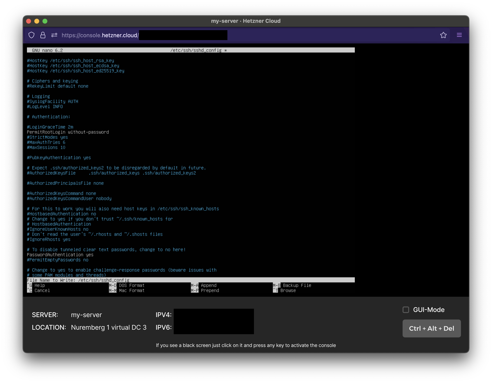

Since we've modified the SSH server configuration, we'll need to restart the daemon so that it can pick up the new changes.

Depending on your linux distro, you might have different commands to start/stop/restart services.

You can try one of these commands, but make sure you search how to do this for your specific OS.

- `sudo /etc/init.d/ssh restart`
- `sudo systemctl sshd restart`
- `sudo service ssh restart`.

The service should now be restarted and now we're ready for testing.

## Login via SSH

In a fresh terminal window, let's try SSH'ing into our VPS with our user.

Let's assume the 😁 happy path and that you know your user's password.

```bash
ssh <user>@<vps_ip_address>
```

You should be able to make a connection to your VPS if your user exists and be prompted to enter a password.

Once you enter it, you'll be able to see a welcome message.

Now let's talk about some 😞 sad paths.

Running into this error:

```bash
ssh: connect to host xx.xxx.xxx.xxx port 22: Connection refused
```

This can mean a lot of things: your VPS has a firewall and port 22 is not accepting incoming connections, the VPS package openssh-server was improperly installed or misconfigured, your local machine may have it's own firewall, etc.

My problem with this error was that my `fail2ban` client had banned my IP address because I failed to log in too many times.

All I had to do was remove my banned IP address, and I was able to regain access.

If you're in the same boat, follow this guide I found for [How to Unban an IP Properly with Fail2Ban](https://serverfault.com/questions/285256/how-to-unban-an-ip-properly-with-fail2ban).

A second reason why I think this could happen is because you forgot your user's password.

You will have to reset your user's password via the root user. There are many tutorials online on how to do that and I will not be covering that topic here.

## Remove old SSH keys

Now that we are logged in as our user, we can remove the old SSH keys that were tied to our previous device.

I haven't found a tool to remove old SSH keys yet other than doing it by hand, so that's what we'll do.

In the terminal, enter `nano ~/.ssh/authorized_keys`

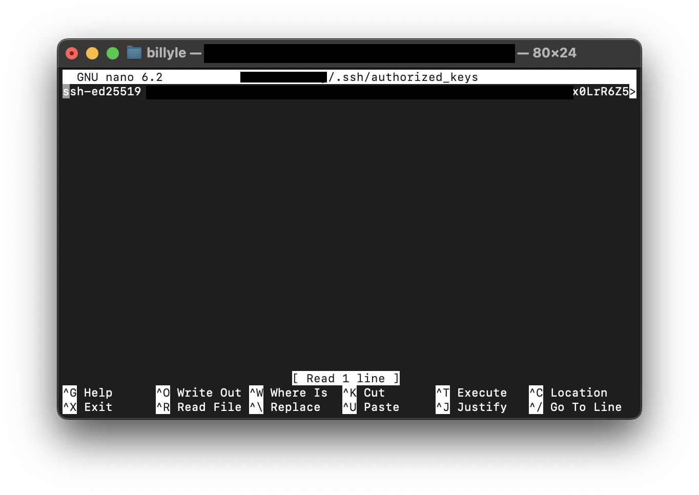

You should see your old SSH key there. If you have many keys, you may need to figure out which key belongs to your old device and remove it.

Go ahead and delete the whole line.

Once completed, save the file again using the steps above with <kbd>CTRL</kbd> + <kbd>X</kbd>.

That should be all to remove the old key from the remote server.

There are some scripts that do this online, but I didn't try them since I don't know what they're doing.

Here is the reference I looked at if you're interested: [Command to Remove a SSH Authorized Key on Server](https://superuser.com/questions/429954/command-to-remove-a-ssh-authorized-key-on-server).

## Create and add new SSH Key

If you don't know how to create an SSH, I got you covered.

I wrote about it in [my blog post about setting up Coolify](/posts/self-hosting-your-website-with-coolify-v4-a-step-by-step-guide#creating-your-ssh-key).

Once you have an SSH key, we're going to use `ssh-copy-id` which will copy all your keys to your remote server.

The `ssh-copy-id` command will only add your public keys to the remote server by appending it to the target user's `.ssh/authorized_keys` file.

Once you're ready, enter:

```bash
ssh-copy-id <user>@<vps_ip_address>
```

or if you want to use a specific key, use:

```bash
ssh-copy-id -i ~/.ssh/my_public_key <user>@<vps_ip_address>
```

Replace `my_public_key` with your public key, e.g., id_ed25519.pub, id_rsa.pub, etc.

To ensure it's properly added, we can test it by running the command again.

If you want more information on how the command works, take a look at this [SSH Copy ID for Copying SSH Keys to Servers](https://www.ssh.com/academy/ssh/copy-id) article.

After that, we'll want to add the SSH key to the keyring so that you don't have to retype your password every time you SSH into the VPS.

In your terminal, enter `ssh-add`

You will see one or more keys added.

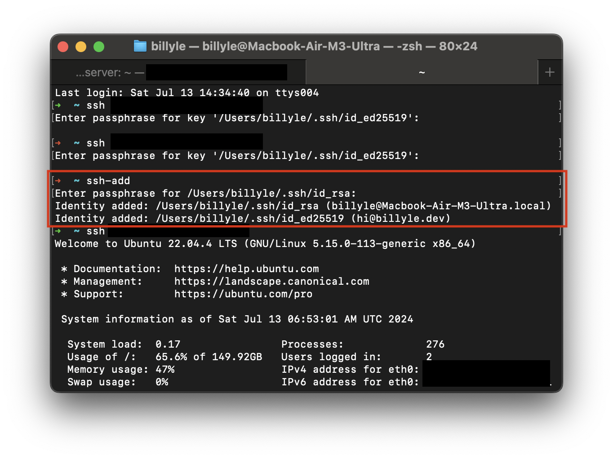

What is `ssh-add` and what does it do? [Peter John Acklam](https://superuser.com/users/106410/peter-john-acklam) put it best:

> ssh-add adds private key identities (from your ~/.ssh directory) to the authentication agent (ssh-agent), so that the ssh agent can take care of the authentication for you, and you don’t have type in passwords at the terminal.

## Reset the PasswordAuthentication

Going back to the `/etc/ssh/sshd_config` file, we're going to roll back our changes so that 'PasswordAuthentication' is inactive.

This improves security and convenience since you won't be asked to enter your password if you don't have an authorized SSH key.

Assuming you have root access for your user, you can use the `sudo nano /etc/ssh/sshd_config` command while still connected to the server.

If you don't, you'll have to switch to the root user using `su - root` and enter your root password.

Set PasswordAuthentication to "no".

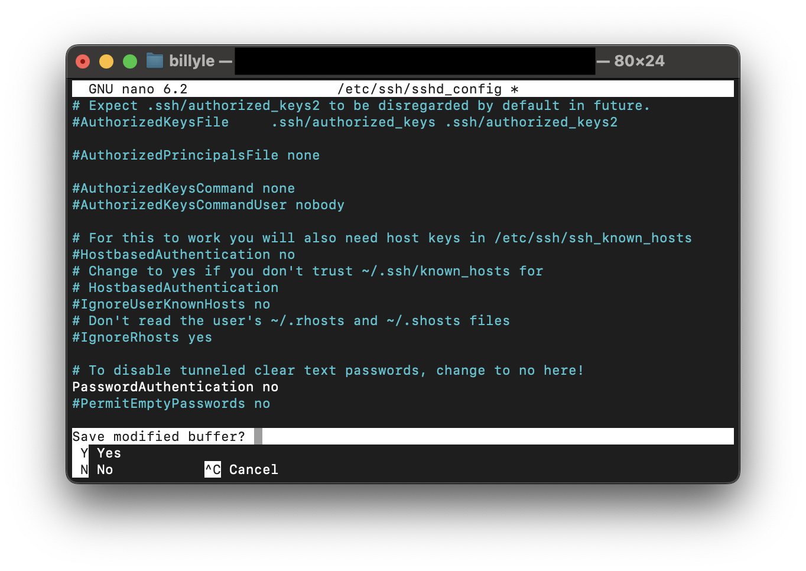

Save the file, and restart the SSH server as before via one of these commands:

- `sudo /etc/init.d/ssh restart`
- `sudo systemctl sshd restart`
- `sudo service ssh restart`.

## Login from a new shell

To test everything works, open up a new terminal window.

Attempt to access your user account via SSH.

```bash
ssh <user>@<vps_ip_address>
```

If all goes well, you should have access without entering a password. Hooray! 🥳 we regained access to our VPS on our new device.

Hopefully, these steps helped you regain control of your server.

If not, please reach out and I'll try my best to help even though I'm still a novice at this stuff.

Thank you for reading, and as always, have a good one!
