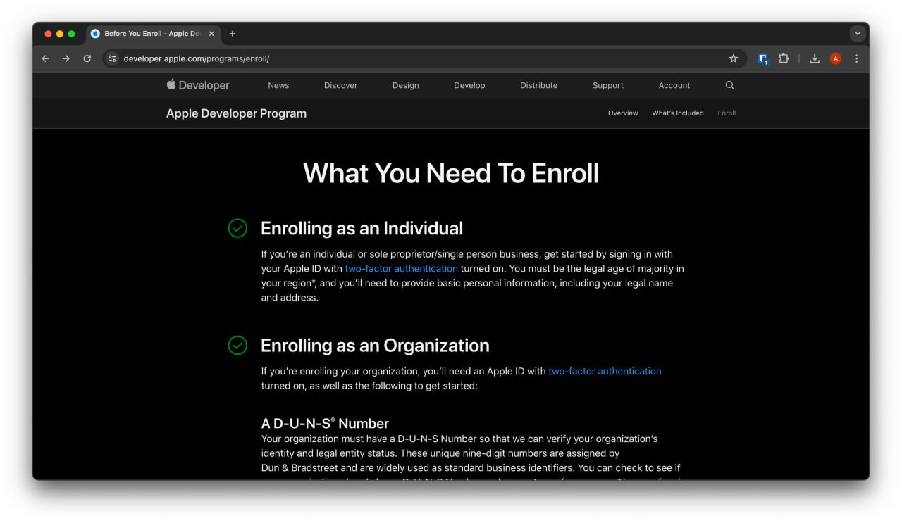
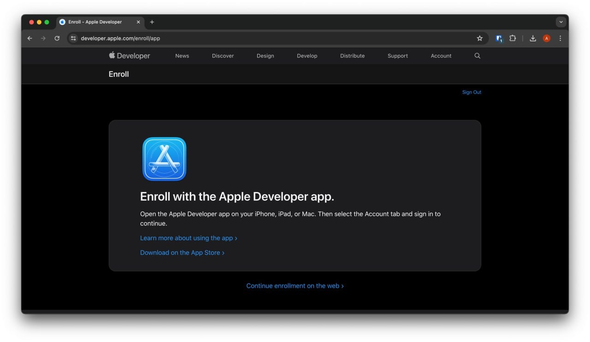
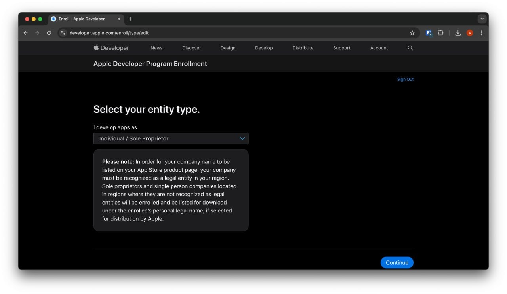
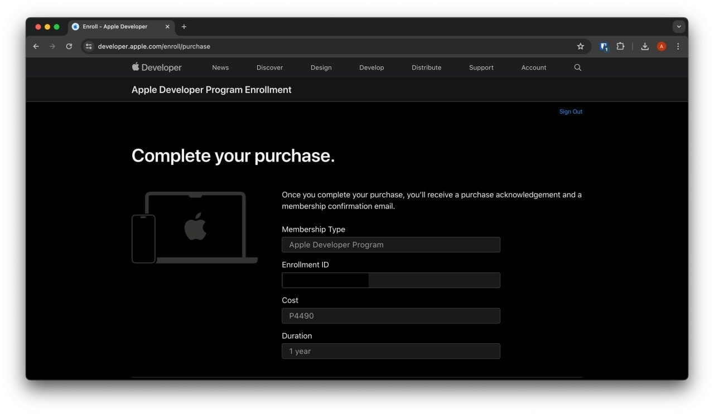
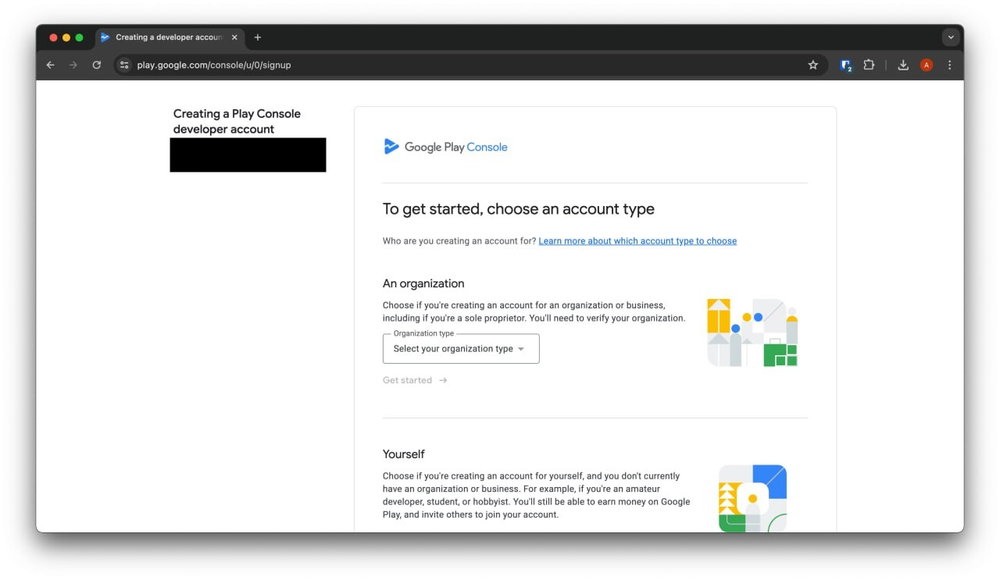
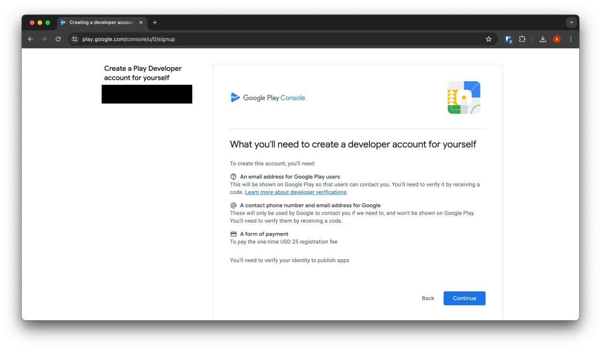
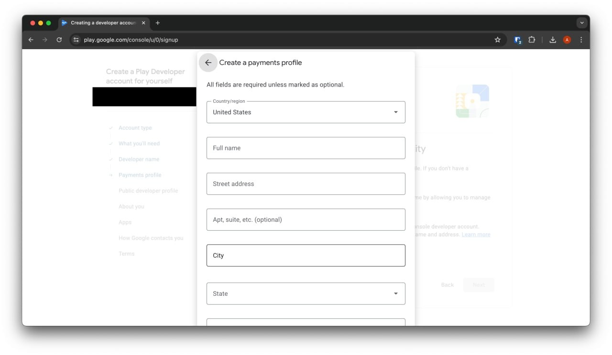
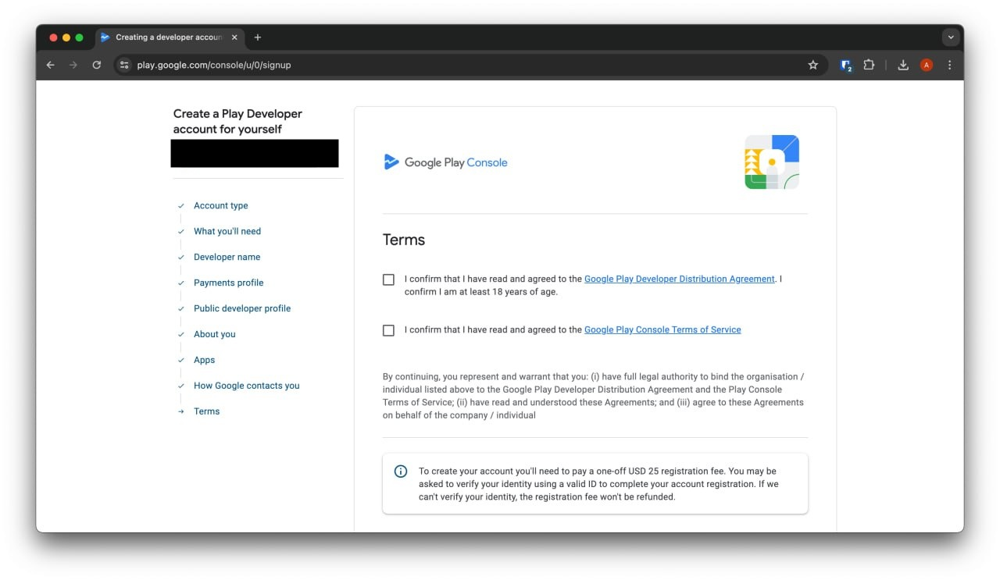

If you read my previous blog, I said I was going to form an LLC. I decided not to because I felt it was too early in my journey.

My goal right now is to build mobile apps. The problem is that I can't publish my projects.

So I signed up for Apple and Google Developer Accounts and wanted to share my research and experience.

## Platform pros and cons

When it comes to comparing Apple and Android for development, I found these metrics important for me as a developer.

|                                   | Apple                        | Google              |
| --------------------------------- | ---------------------------- | ------------------- |
| 🪧 Developer Account Registration | $99 yearly                   | $25 one-time fee    |
| 📊 OS Market Share                | 27.58% **(Q3 '23)**          | 71.72% **(Q3 '23)** |
| 📋 App Reviewal Process           | ~ 48 hours                   | ~ 2 hours           |
| 💰 Revenue Share Model            | 70% to dev / 30% to platform | -                   |
| 💻 Programming Language           | Swift                        | Java, Kotlin        |
| 📱 Emulator Support               | iOS devices, Andriod         | Android             |

Apple costs a lot more than Google year-over-year and the strict review guidelines can slow iteration cycles but offer consumers higher-quality products.

For Google, you can iterate and validate ideas much more quickly.

You can also see that Apple owns less of the market share than Google but Apple generates more revenue because people are willing to pay more.

I didn't want to limit myself to one platform so I chose to target both platforms using Flutter as my tool of choice.

## Registration Experience

On both platforms, the registration was pretty straightforward.

There are a few screens where they will ask you what kind of app you're building.

The following screenshots are redacted and incomplete but it should give you an idea of what the process would look like.

### Apple Developer Program

To get started with the [Apple Developer Program](https://developer.apple.com/programs/enroll/), you will start on their enrollment page.

Click "Enroll" and you'll be asked to sign in. After signing in, you'll see these next few pages.

I chose the Sole Proprietor account since I am not at the point where I need to form an LLC.

This should be the last step but if not, you'll have to enter your payment details.

### Google Play Console

The same goes for [Google Play Console](https://developer.android.com/distribute/console). Sign in and follow the flow.

Here are some screenshots from the Google Play Console's registration.

You would create a new Payment Profile if you never had one.

And lastly, you'll come to the Terms page. You can see all the steps on the left-hand side that you'll have to complete.

## Approval process time
Google **immediately** activated my account. After activation, you still need to verify with them before you can publish any apps.

Google will ask you to verify by uploading a valid ID or using a physical Android device.

For Apple, I thought the approval would take longer. I've read that it may take up to 5 weeks for them to approve them but that wasn't the case for me.

It only took Apple **one day** to approve my account.

## Wrap-Up

I know this post wasn't technical or anything but I hope it gives you an idea of what the registration process is for both platforms.

I'll be doing some mobile development in the coming weeks, so I hope I can share with you those experiences as well.

Thanks for reading and have a good one!
