If you're thinking about hosting your own stuff but don't know where to start then you're not alone. I thought about what it meant to leave the safe walls of services like Netlify, Vercel, Render, etc. It was a tough decision because those are professional services that provide high security and technology which I have zero knowledge of.

But after some considerations, from listening to [Syntax's episode of self-hosted platform-as-a-service](https://syntax.fm/show/730/own-your-own-paas) (from here on out will refer this to as PaaS), wanting to host multiple websites and demo apps on a single server, and reading the [viral Reddit post](https://www.reddit.com/r/webdev/comments/1b14bty/netlify_just_sent_me_a_104k_bill_for_a_simple/) of Netlify charging a user for over $100k USD on a free tier, I wanted to try this out on my own.

After a lot of trial and error, I detached my billyle.dev from Netlify and have it running on my own server! Now I'm going to teach you how I did it.

## What you're going to need

Here's what you're going to need if you're planning to do this:

- A domain name (My domain is registered with Cloudflare)
- A remote server you can SSH into (I used Hetzner and the referral link from Coolify)
- A git repository of what you're going to deploy
- SSH public key on your device (optional)

**Note:**

It's worth noting that I had to fiddle with the DNS around a lot near the end of this tutorial, but I found that having your domain on Cloudflare is a better experience. Initially, I had my domain on NameCheap. While it was working, I was experiencing strange behaviors like slow load times on the desktop versus mobile.

Even running the page speed test, it was able to view the mobile but the desktop failed.

I figured it would all be easier if I paid the $10 USD transfer fee over to Cloudflare and that's exactly what I did.

## Creating your SSH key

If you want to use your password for SSH'ing remotely onto your server, you will have to perform this step. Otherwise, you can just skip to the next section since Hetzner will email you the root password if you omit it. You can also skip this step if you already have an existing SSH key you want to use.

In your terminal, follow these commands:

```bash
ssh-keygen -t rsa -b 4096
```

You will see this prompt.

```
Generating public/private rsa key pair.
Enter file in which to save the key (/Users/billyle/.ssh/id_rsa):
```

Hit enter and use the default path, and then you will be asked to enter a passphrase twice. Once to enter, and twice to confirm. I suggest you make it a strong password and save it to a secure location like an encrypted note on a password manager.

```
Enter passphrase (empty for no passphrase):
Enter same passphrase again:
```

Once you get past that step, you have created your SSH key. You will see something similar below.

```
Your identification has been saved in /Users/billyle/.ssh/id_rsa
Your public key has been saved in /Users/billyle/.ssh/id_rsa.pub
The key fingerprint is:
SHA256:xcAmxtStfRBiLtm7HIU44NrI0mF9geOYT87SoT9xVmQ billyle@mbp.local
The key's randomart image is:
+---[RSA 4096]----+
|    .+oo+...     |
|   oo.+BE=o      |
|  o+oo*=+o+.     |
| +o=+. oo+. .    |
|. =B.. .S  .     |
| .o * o. o       |
|   o +  o        |
|    o            |
|     .           |
+----[SHA256]-----+
```

I will show you how to use this key in the next section.

## Shopping on Hetzner

Let's say you have your domain ready, and now you're for the next step - buying your remote server. Hetzner was an obvious choice for me compared to other companies that charge quite a lot for the same offerings (looking at you, Heroku and Digital Ocean). Hetzner is cheap and seems like a popular choice among the Coolify crowd.

When picking a server, there are some details you want to pay attention to:

- the location where you think most of your traffic will come from (I chose Germany since it's a nice in-between Continental US and Asia)


- the image you want to use on the server (Ubuntu is a great choice)

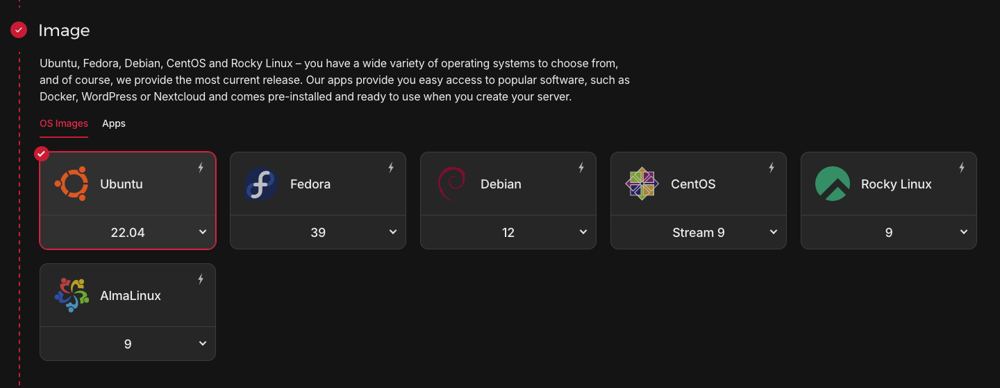

- whether you will need shared or dedicated vCPU (shared is the best price/performance)


- the server resources like how many CPUs, RAM, and storage your sites and apps will consume. To run Coolify, these are the minimum requirements
  - 2 CPUs
  - 2 GB memory
  - 30+ GB of storage for the docker images.


- lastly, your monthly budget

### Add your SSH key

After your selection, you may want to include your SSH key. Skip this if you want Hetzner to email the password to you.

Under the section titled "SSH keys", click on "Add SSH Key" and a modal will pop up.

Back to the terminal now, we're going to copy our SSH key and paste it into the modal.

```
cat ~/.ssh/id_rsa.pub
```

The `.pub` signifies that this is the public key and the output will look something like this:

```
ssh-rsa AAAAB3NzaC1yc2EAAAADAQABAAACAQDbQj5IxxXslqfOl4Qv5Ux0RNbofCVy5EWbkosc2AnDj6XAFZSdLNwlPG1qnckhuWCeHveWmJAU80G9d4eTvV/W4bKOE8jj0iqVCFHLXdgOlbO+WQgpVDKjhAnRlaJfPNiLvAn0yNr/Sj1ESbMzBwNK4bjTBCMOalvq/NUqz+3bcewdlc3gDunvdmGf4RbfUydZ73rhO0Bg/r+u7NWT1pghcFW/E/E9f6OavBzyHRSSP0MJQYx3bnmgpFcmZlz/3O0gUaxLGXAmFAsaYxAZ7iZXz8AWw2DmcaNlf+lyAYOQ2TGVaZ4VAUwDQE/8u4zFaX+HooUScgTY3oUztIHFDFgyu6Q4N6ILj/aujnSiuv5fW9PiQ70Jce78IMTAlRSqVeBxRgK8Di5eHECFOH+chNp9UhThw+ZO4dHBwxngdZcbd7xmX3hczS1DnYgtOKUIWzx6rUGrN1wsMsdJS4GAWHvhtWMZITqvg4XXEsMdFtKZ8pJj8O8qjNyPEmfYg1upVmoGufcCCbIRY0CKzBeer3hpqD74EcGyB0TJmeHQezCMsmdBW9DJNPDtCfL/zMMXyqtyjsddkl8AbloZmlkgHDLtSscfWeLtMMX1DkT13LoekjL11ZCOMU5vAWvKiJGxU0NRFRStHU/AIpRqDBtD+VFPRWa0javzgXZTr3ALQun5jQ== billyle@mbp.local
```

Highlight all the output and then paste it into the modal and then click save.

After that, you will want to review your Hetzner configuration before you complete the transaction. If all looks okay, go ahead and
create it. It will take less than a minute to spin up your new server. If you mess up, you can always delete the server and start a new one since they charge by the hour.

## Installing Coolify

Once your server is created, you will see an IP address for your remote server. This is how you will connect to it and configure your server to use Coolify.

In your terminal, type in these commands:

```bash
ssh root@<server_ip_address>
```

Where `<server_ip_address>` is the one provided to you by Hetzner.

The next prompt will ask you to add the IP to your known hosts list. Type in "yes" here. Then you will enter the passphrase that you used to create the SSH key or the password that Hetzner sent to you by email.

```
The authenticity of host '162.55.37.168' can't be established.
ED25519 key fingerprint is SHA256:L1WGqdh9jEOSIrQ/eNcDOtgyYNDWCbTIlEtMcp8rs10.
This key is not known by any other names.
Are you sure you want to continue connecting (yes/no/[fingerprint])? yes
Warning: Permanently added '162.55.37.168' (ED25519) to the list of known hosts.
Enter passphrase for key '/Users/billyle/.ssh/id_rsa':
```

You should now have remote access to your server and execute commands.

```
Welcome to Ubuntu 22.04.3 LTS (GNU/Linux 5.15.0-91-generic x86_64)

 * Documentation:  https://help.ubuntu.com
 * Management:     https://landscape.canonical.com
 * Support:        https://ubuntu.com/advantage

  System information as of Sun Mar  3 03:54:34 AM UTC 2024

  System load:  0.0               Processes:             100
  Usage of /:   5.1% of 37.23GB   Users logged in:       0
  Memory usage: 5%                IPv4 address for eth0: 162.55.37.168
  Swap usage:   0%                IPv6 address for eth0: 2a01:4f8:c012:7c82::1


Expanded Security Maintenance for Applications is not enabled.

0 updates can be applied immediately.

Enable ESM Apps to receive additional future security updates.
See https://ubuntu.com/esm or run: sudo pro status


The list of available updates is more than a week old.
To check for new updates run: sudo apt update

root@ubuntu-4gb-fsn1-1:~#
```

If you go to [Coolify.io docs](https://coolify.io/docs/installation) and search for installation, you should see the installation script which looks like this:

```bash
curl -fsSL https://cdn.coollabs.io/coolify/install.sh | bash
```

Enter the command and let the installation script do its thing. Once that's complete, you will see an output with an IP address where you can access the Coolify instance on your server, in my case it was `http://162.55.37.168:8000`.


Copy the IP address along with the port and enter that in your browser's URL. You will be directed to the registration screen for Coolify.

## Coolify Onboarding Experience

Coolify has a good onboarding experience as it will guide you through a series of steps to get up and running.

When you follow the IP address from the Coolify installation, you will be taken to a registration page. You will use these credentials to log in to the Coolify instance where we will host it on your domain.

Be sure to use a strong, unique password since this is how you will interface with Coolify on your custom domain.

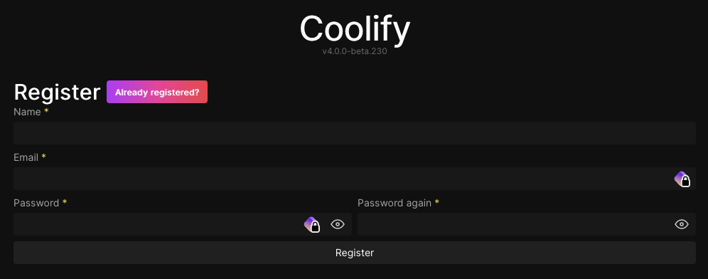

You will be prompted with a series of onboarding questions. Just keep clicking next until you see the page, "Server".

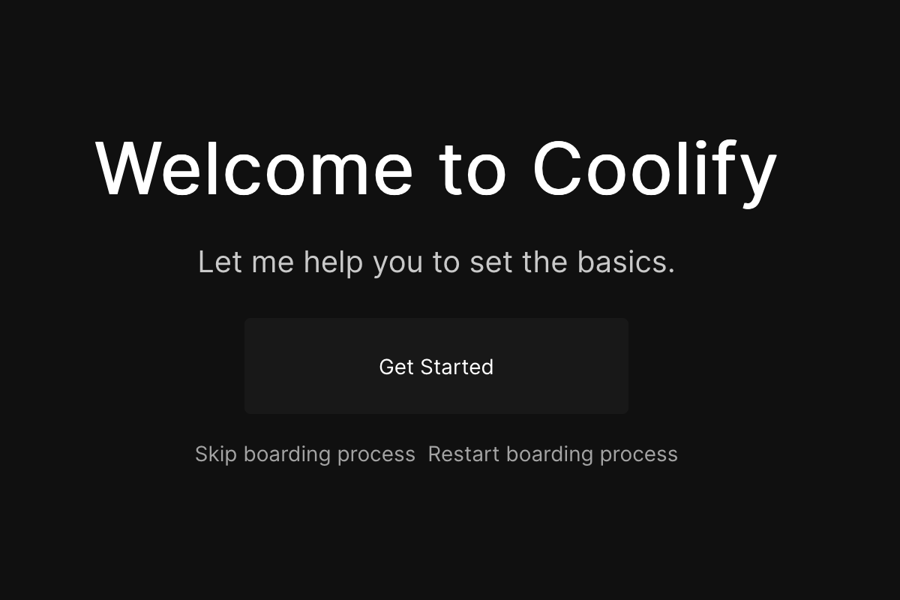

You will select "localhost" as that's where this instance of Coolify is installed.


Then you will create your first project. These projects are a way to organize your resources under one umbrella. Here you will be adding your first project so click on "Let's create a new one". This will create a project called, "My first project" for you.

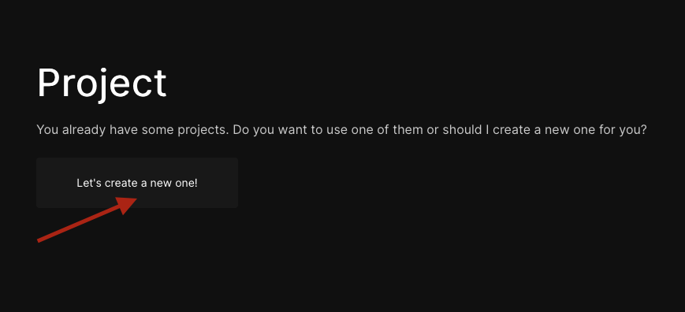

After that, the next page says something about adding resources. Resources are things that your app or website needs such as databases, servers, etc. Click on the "Let's do it!" button.

If you're deploying a static site, chances are, you only have one resource to deploy. For me, it was a Public Git Repository resource that I had to add.

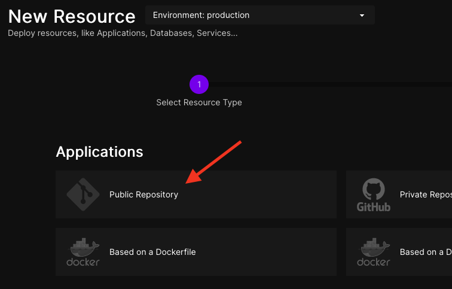

When you click that, you will be asked which server you like to use. There should be only one and that's "localhost" from before.


Then it will ask you to select a Destination. Just choose the only option which should be a Standalone Docker instance called "localhost-coolify".


And lastly, it will ask you for the URL for the public repository. Find that and paste it into the field. It will get the metadata from the git repo and should populate all the necessary details.

The important part here is the Publish Directory where the build output will be. Also, toggle the "Is it a static site" toggle if it applies to you.


You should now see a configuration page for the resource you just created. There's a lot on this screen but we're going to focus solely on deploying to see if we can get Coolify to build our application. On the top right corner, click "Deploy"

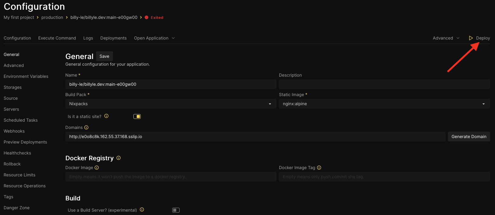

You will be taken to the Deployment page and your build logs will start appearing. Hopefully, there won't be any errors and you will see a "New container started" as the last log entry and your deployment says "Finished".

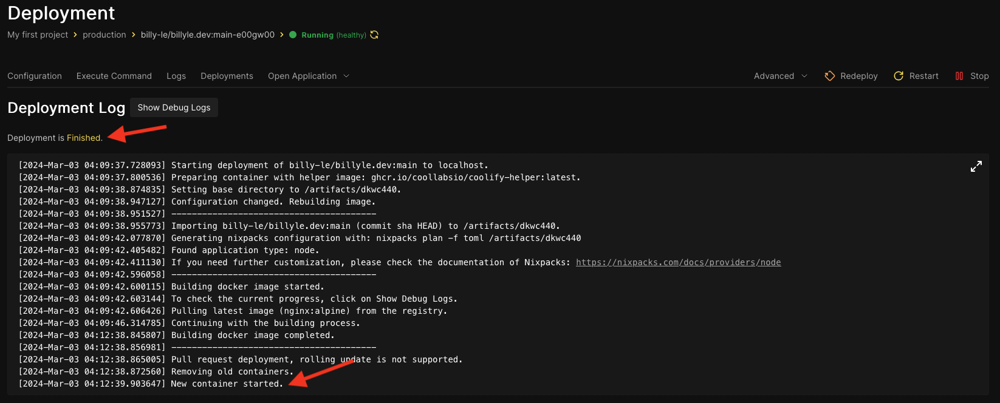

Now we can test to see if Coolify can serve the website. Click on the "Open Application" button and select the auto-generated link to view your site.

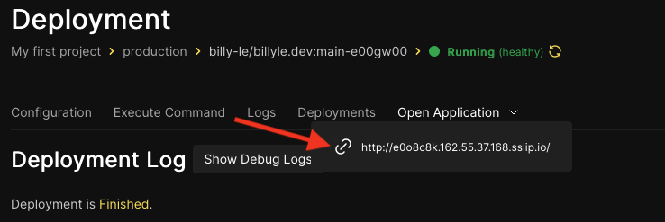

And tada! I can see my own site being served by Coolify on Hetzner.

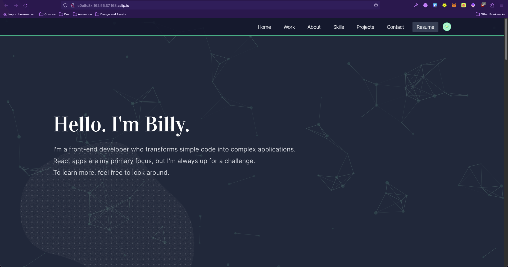

Keep your Coolify page open for the next part as we still need to tinker with it later.

## Proxy domain from Cloudflare to Coolify

Now all we need to do is some configuration between Cloudflare and Coolify. We need to point our domain in Cloudflare to our Hetzner server and Coolify will serve our applications.

It took me a long time to figure this out so there might be some trial and error on your part, but I hope this next set of instructions just works for you.

### Enforce Strict SSL/TSL Mode

This next part is important! Navigate to the SSL/TLS page in Cloudflare.

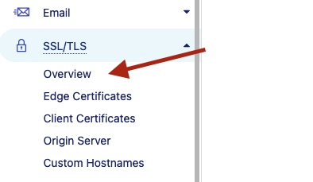

We want to turn on SSL Full (strict) mode to allow Coolify to serve HTTPS for us.

By default, SSL will be on Flexible mode and if you had this on, both Coolify and Cloudflare will be stuck in a redirect loop causing the page to throw a "Too many redirects" error.

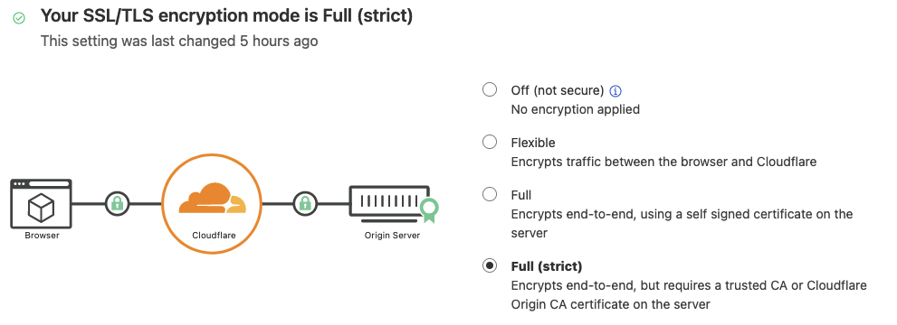

### Access Coolify from our domain

In your Cloudflare dashboard, go to the DNS Records Management page for your domain. We want to add a subdomain for our Coolify instance.

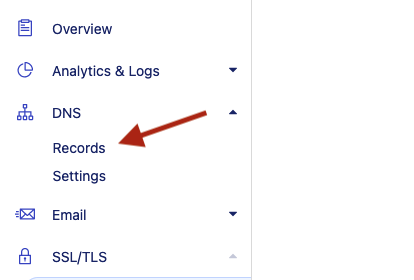

Add a new "**A**" record, with the hostname "**coolify\*\***", and the value is the IP address of your remote server, and click save.


Go back to Coolify, and go to the Settings page.


In the "**Instance's Domain**" field, type out `https://coolify.<your_domain>`. Notice that we added HTTPS here. Coolify will automatically generate a SSL cert when it sees this configuration. Be sure to hit save.


Let's see if we can now access our Coolify instance from our domain instead of the Hetzner server IP address.

Head over to `https://coolify.<your_domain>` and check out your new Coolify on your domain! If it doesn't load yet, wait a few moments until the DNS propagates.

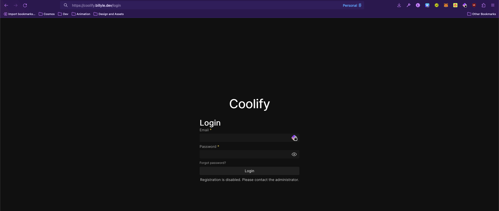

Now login with the credentials you used to register in the initial Coolify setup, and you should now be at the Coolify dashboard.

### Linking Coolify app to your domain

From the Coolify dashboard, navigate back to your project configuration dashboard. We're going to change the auto-generated domain that Coolify created to use our domain.

Type in your domain and then click save. After you save, make sure to click "Redeploy" or else this won't work.


Back to Cloudflare, we need to create more DNS records to make sure our domain is pointed to our server.

So head on back to the Cloudflare DNS Management and enter a new "**A**" record, with the hostname "**@**", and the value should be the Hetzner server IP address.


Now give it a couple of minutes and visit your domain. You should see live! How cool is that?

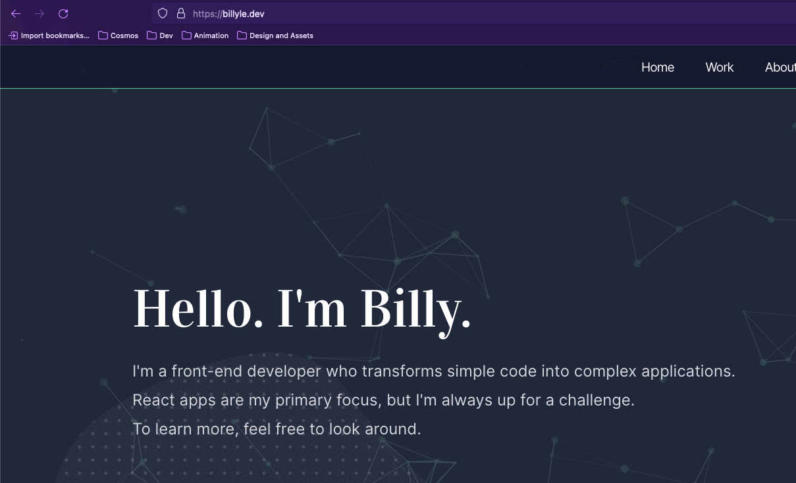

## Redirect www to non-www

We're almost done with the long tutorial. I was excited when I got this far and I hope you are too.

This last part is the final section and what we're going to do is redirect our `www.<domain>` to just `<domain>`.

All of this will happen in Cloudflare so we don't need to mess around with Coolify.

In Cloudflare, back in our DNS management, we're going to add two records.

The first one is an "**A**" record, with the name of "**www**", and the value of `192.0.2.1`. This is saying we are creating an ALIAS record that uses the `www` subdomain, and we are pointing to a dummy IPv4 address.

The dummy IPv4 address is insignificant since Cloudflare will redirect all traffic before reaching the IP address.


Now we'll create the IPv6 version with another "**AAAA**" with the name same name but this time the IPv6 address is `100::`


While that's being propagated, we need to set up the actual redirect rules in Cloudflare.

Head over to the Rules Redirect page

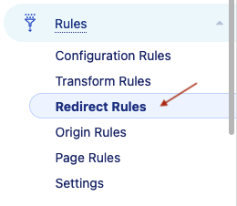

Once there, click on "+ Create rule" where you'll be taken to a form.

Add the name of your Redirect Rule. I named mine "www to apex".

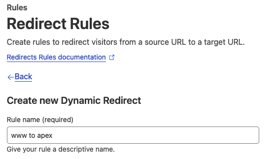

Then click on "Edit expression" where you'll type in the rule expression. Replace `billyle.dev` with your actual domain.


```
(http.request.full_uri contains "www.billyle.dev")
```


The last input field is where Cloudflare does something when it matches the condition above.

We want a "Dynamic", with a "301" permanent redirect and our expression will be:


```
concat("https://","billyle.dev",http.request.uri.path)
```

Again, replace `billyle.dev` with your actual domain and make sure the "Preserve query string" is checked.

Now test it out after a few minutes to see if it works. Visit `www.<your_domain>` and see if it redirects you to the root domain.

## That's it! You're done!

Wow, that was a lot! I'm glad you made it all the way through. I hope you're proud of what you did here. This is our new journey down self-hosting PaaS.

The days of paying for a droplet and managed db are over for me.

You've learned how to create a remote server with Hetzner, SSH into it, and install Coolify. Then you managed to link your domain to Coolify and deploy your website!

I think it's so cool that we now have our server to deploy any application we want. Eventually, I will create another tutorial when I start deploying my demo apps, so people can use it. So stay tuned for that.

If you have any questions, feel free to email me or contact me through my social media links.

And thank you for reading! Hope you have a great rest of your day wherever you are.
