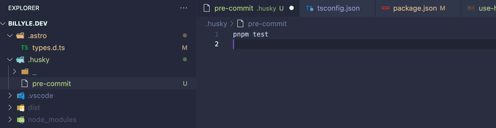
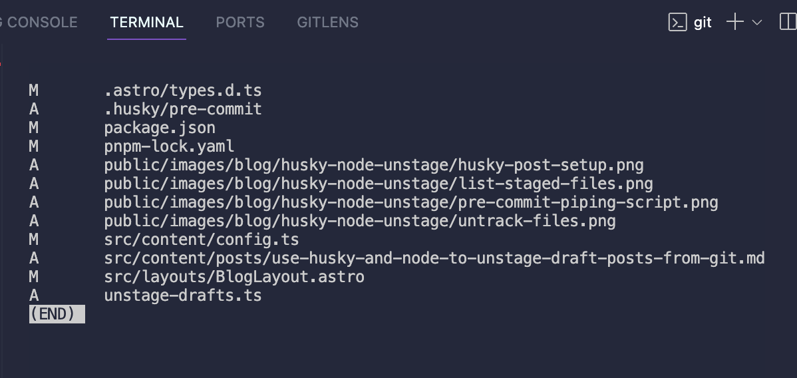
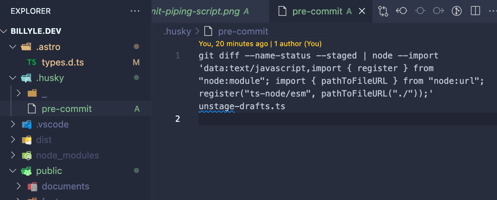
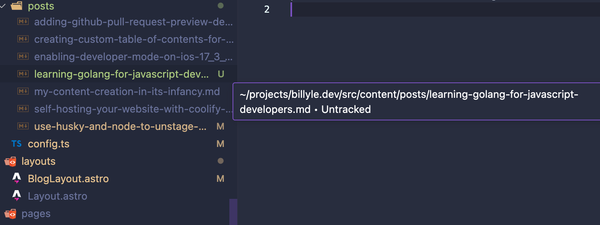

Astro allow us to only create static files during the build step for published work by filtering through collection and filtering out draft posts. But it doesn't prevent Git from knowing the context of your collection.

So what ends up happening is you might check in your drafts into your Git history. From me, I didn't want my draft blog posts to be viewable until they are ready to be published.

I thought about adding my draft files into another folder and use gitignore but it wasn't an elegant solution since I have to manually move files from the drafts folder and into the proper folder each time I want to publish a blog.

A solution I came up with was to use Husky to trigger pre-commit scripts and unstage all my markdown drafts. I'll show you exactly how I did that below.

## What is Husky?

If you don't know what Husky is, it's a program that will run during different lifecyles of your Git workflow. This is particularly useful for doing a bunch of things before and after committing files in your Git history.

Usually you will see the `pre-commit` hook used often for performing linting, prettifying, or running tests on your project.

### List of Git Hooks Husky supports

Husky supports all client-side Git hooks. There are 13 of them total.

- applypatch-msg
- commit-msg
- post-applypatch
- post-checkout
- post-commit
- post-merge
- post-rewrite
- pre-applypatch
- pre-auto-gc
- pre-commit
- pre-push
- pre-rebase
- prepare-commit-msg

If you're interested in what Git hooks are, here is a list of all the different [Git hooks](https://git-scm.com/docs/githooks).

## Install Husky

To [install Husky](https://typicode.github.io/husky/), you need to have `Node` installed since you will use `npm`.

I use `pnpm` but you can use any package manager supported in the link about.

Run the command `pnpm add husky -D`. This will install Husky as a devDependency.

Then run `pnpm exec husky init` so Husky can take care of the setup for you.

If you look in your project now, you should see a `.husky` folder. If you look inside, you will see a `pre-commit` file with the command `pnpm test` inside.



As a concept, if you tried to run `git add .` and `git commit -m "my message"` the pre-commit hook will trigger and run `pnpm test`. If your test happens to fail, then it won't commit anything and your Git history remains untouched otherwise you're golden.

## Retrieving a list of your staged files

Now we need a way to list out all the files that are staged in Git. Luckily for us, we can do that with this command, `git diff --name-status --staged`.

This command is grabbing all staged files that were changed and returning the status mode and file names. This is how it would look in your terminal:



Press <kbd>q</kbd> to kill the process.

## Preparing the Node script

Our next step requires us to write a Node script. Since my project is written in Typescript and I want to take advantage of the type system, so I am using `ts-node` to run the script.

However, if you're just using Node, then you can change the file extension to `.js`, remove the types and it should work the same.

### Prerequisites

- Install `front-matter` and `ts-node` packages
- Ensure you have a Post schema type

We need a way to read from our front-matter in our `.md` files. I found this package, [front-matter](https://www.npmjs.com/package/front-matter), that easily allows us to get key-value pairs of our markdown.

### The meat of the script

I created a file in my root directory called `unstage-drafts.ts`.

We'll need to change who can access the file with `chmod`, so in your terminal run the command `chmod 777 unstage-drafts.ts` to change the permissions.

Then inside the file, I wrote this script:

```typescript
import fs from "node:fs/promises";
import childProcess from "node:child_process";
import util from "node:util";
import fm from "front-matter";
import type { Post } from "src/content/config.ts";

const execPromise = util.promisify(childProcess.exec);

let data = "";

process.stdin.on("readable", () => {
  let chunk;

  while (null !== (chunk = process.stdin.read())) {
    data += chunk;
  }
});

process.stdin.on("end", async () => {
  // process all markdown files and unstage any draft posts
  const stagedFiles: string[] = [];
  const markdownFiles: string[] = [];

  data
    .split("\n")
    .filter((x) => x)
    .forEach((line) => {
      if (line.endsWith(".md")) {
        if (!line.startsWith("D")) {
          const markdownFile = line.split("\t")[1] as string;
          markdownFiles.push(markdownFile);
        }
      } else {
        stagedFiles.push(line);
      }
    });

  let draftCount = 0;

  for (const file of markdownFiles) {
    const content = await fs
      .readFile(file, { encoding: "utf-8" })
      .then((f) => fm<Post>(f));

    if (content.attributes.draft) {
      draftCount++;
      await execPromise(`git reset ${file}`);
    }
  }

  if (draftCount === markdownFiles.length && !stagedFiles.length) {
    throw Error("only draft posts were staged.");
  }
});
```

### Script breakdown

Let's do a quick break of what's going on.

The necessary imports of modules I'm using:

```typescript
import fs from "node:fs/promises";
import childProcess from "node:child_process";
import util from "node:util";
import fm from "front-matter";
import type { Post } from "src/content/config.ts";
```

The command `git diff --name-status --staged` writes to out `stdout` so we can read from it in Node by using `process.stdin`.

Here we're listening to the event "readable" which is a stream of bytes. Then each chunk is appended in our `data` variable.

```typescript
let data = "";

process.stdin.on("readable", () => {
  let chunk;

  while (null !== (chunk = process.stdin.read())) {
    data += chunk;
  }
});
```

We're going to `promisify()` our `childProcess.exec` so we can await it later.

```typescript
const execPromise = util.promisify(childProcess.exec);
```

When our readable stream ends, we will listen to the event `end` and run an async callback function that uses the `data` variable to process all the staged files.

```typescript
process.stdin.on("end", async () => {});
```

I have two variables - one that will keep track of non-`.md` files and another to store markdown files, respectfully called `stagedFiles` and `markdownFiles`.

I split the data by new lines and then filter valid entries. Then for each item in the array, I test some conditions to check the file is `.md` or not.

If it is a markdown file, we want to check if it's not a `D` status. The "D" status here means that I untracked the file that is previously tracked by Git and I don't want to unstage those changes.

If it not "D" then we push it the `markdownFiles`.

```typescript
const stagedFiles: string[] = [];
const markdownFiles: string[] = [];

data
  .split("\n")
  .filter((x) => x)
  .forEach((line) => {
    if (line.endsWith(".md")) {
      if (!line.startsWith("D")) {
        const markdownFile = line.split("\t")[1] as string;
        markdownFiles.push(markdownFile);
      }
    } else {
      stagedFiles.push(line);
    }
  });
```

After we have a list of our staged markdown files, we're going to process each file in a for loop and read from the front-matter. If the post is a draft, we update a counter and call `await execPromise()` to unstage it .

```typescript
let draftCount = 0;

for (const file of markdownFiles) {
  const content = await fs
    .readFile(file, { encoding: "utf-8" })
    .then((f) => fm<Post>(f));

  if (content.attributes.draft) {
    draftCount++;
    await execPromise(`git reset ${file}`);
  }
}
```

This next condition is a guard to check if there are staged files to commit while also checking if all staged markdown files were drafts. If this ends up being true, it must mean we probably did a `git commit` on staged files that were only markdown drafts. I threw an error so that there isn't an empty commit history if this does happen.

```typescript
if (draftCount === markdownFiles.length && !stagedFiles.length) {
  throw Error("only draft posts were staged.");
}
```

That's the entirety of the script. As you can see, you can do a lot more in this script if there are extra requirements.

## Piping it all together

Back in our `.husky/pre-commit` file where we had a single line of `pnpm test`, we're going to replace that by combining both the `git diff` and the Node script by using the piping method.

Replace `pnpm test` with `git diff --name-status --staged | node --import 'data:text/javascript,import { register } from "node:module"; import { pathToFileURL } from "node:url"; register("ts-node/esm", pathToFileURL("./"));' unstage-drafts.ts`



The verboseness of the command above is important to Typescript and Node.

If you're not using Typescript, it will look a lot simpler:
`git diff --name-status --staged | node unstage-drafts.ts`

## Untracking files already committed to history

There's one other important thing that I want to do -- removing my existing drafts in my Git history so they are no longer available in my public repo.

To do that, run the command `git rm --cached <path/to/file>`.

I have one file, `learning-golang-for-javascript-developers.md`, that is a draft and is already in my Git history. I want to remove it so I run `git rm --cached src/content/posts/learning-golang-for-javascript-developers.md`.

Now the file is labeled as Untracked by Git.



## Seeing the pre-commit hook in action

Time to put it to the test and make sure our drafts are no longer being committed. Running the commands in order to make sure I have everything staged correctly.

1. `git add .`
2. `git rm --cached src/content/posts/learning-golang-for-javascript-developers.md`
3. then followed by `git status`.

This is the output:

```
➜  billyle.dev git:(ft/husky-precommit) ✗ git status
On branch ft/husky-precommit
Changes to be committed:
  (use "git restore --staged <file>..." to unstage)
        modified:   .astro/types.d.ts
        new file:   .husky/pre-commit
        modified:   package.json
        modified:   pnpm-lock.yaml
        new file:   public/images/blog/husky-node-unstage/husky-post-setup.png
        new file:   public/images/blog/husky-node-unstage/list-staged-files.png
        new file:   public/images/blog/husky-node-unstage/pre-commit-piping-script.png
        new file:   public/images/blog/husky-node-unstage/untrack-files.png
        modified:   src/content/config.ts
        deleted:    src/content/posts/learning-golang-for-javascript-developers.md
        new file:   src/content/posts/use-husky-and-node-to-unstage-draft-posts-from-git.md
        modified:   src/layouts/BlogLayout.astro
        new file:   unstage-drafts.ts

Untracked files:
  (use "git add <file>..." to include in what will be committed)
        src/content/posts/learning-golang-for-javascript-developers.md
```

Now I will make a `git commit -m "remove existing drafts from git history and unstage drafts"` and see that this blog post is removed from the staging area.

Checking `git status` shows me:

```
➜  billyle.dev git:(ft/husky-precommit) ✗ git status
On branch ft/husky-precommit
Untracked files:
  (use "git add <file>..." to include in what will be committed)
        src/content/posts/learning-golang-for-javascript-developers.md
        src/content/posts/use-husky-and-node-to-unstage-draft-posts-from-git.md
```

Awesome! It worked! I can freely work on all my draft blog posts without ever checking it into Git again.

## The takeaway

So if you're like me and want some bit of automation in your creative process, you can use this solution. I'm pretty sure there are better ones out there but if you like this approach, feel free to take it and use it as your own.

In summary, we learned how to use Husky, piping the `git diff --name-status --staged` command output into Node, and letting our script unstage draft blog posts.

I hope you learned something today and if not, that's alright! I'm glad you took the time to read it anyways.

Well, until next time, happy coding!
